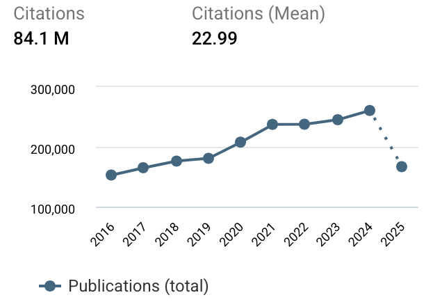
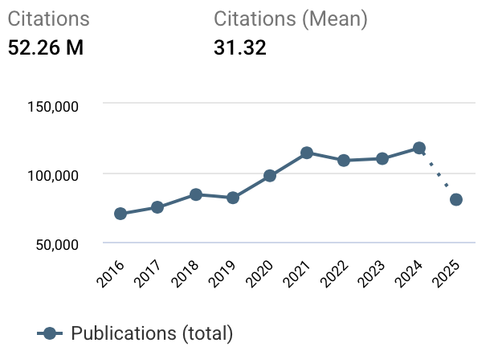
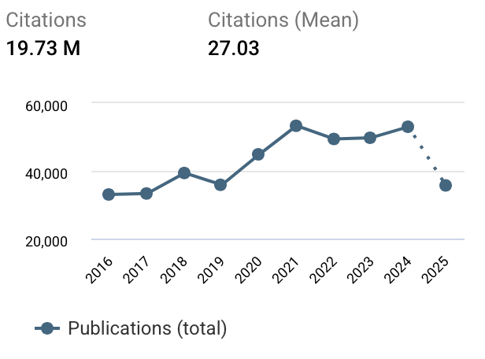

## Neuroimaging is cool

## Neuroimaging is popular
:::::{style="font-size: 65%;"}
:::: {style="text-align:center;"}

{.absolute top=10 left=10 width="350" height="300"}

{.absolute top=20 left=10 width="350" height="300"}

{.absolute top=20 right=10 width="350" height="300"}

::::

MRI paper trends (https://app.dimensions.ai)
:::::

## Data are large

## Models are complex

## Vast compute times

## Lack of GUI

## Goals for course
