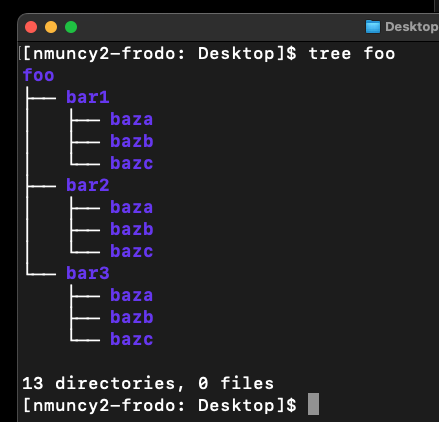

## Building directory trees
<!-- mkdir -p foo/bar{1..3}/baz{a..c} -->
1. Use terminal commands to create the directory tree `foo` (below) on your Desktop.
1. Use `$ history` to find your recent bash commands.
1. Share both a screenshots of the `foo` tree and bash commands with your instructor.

## Extra challenge
1. Can you figure out a 1-line command to do this?