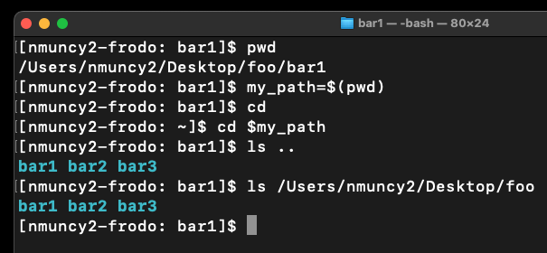
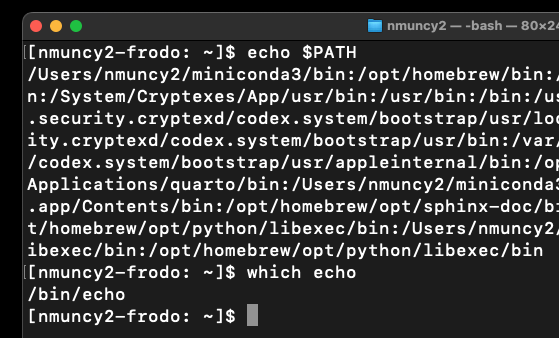

## Strings
::::::: columns
::::: {.column width="50%"}
:::: {style="font-size: 65%;"}
::: incremental
- Series of key strokes:
  - abcd1234
  - Hello World
- Good to avoid spaces (command: argument + parameter)
  - Hello_World
- Data type - integer, boolean, list, array
- Store in a variable
- Access with `$` prefix
  - Print value of variable with `echo`
:::
::::
:::::

::: {.fragment .column width="\"50%"}
```{bash}
#| echo: true
#| message: false

foo="Hello World"
echo foo
echo $foo

bar=Goodbye Sky
echo $bar
```
::::{style="font-size: 65%;"}
::::: incremental
- Why does `bar=Goodbye Sky` break?
:::::
::::
:::
:::::::

## Paths
::::::: columns
::::: {.column width="50%"}
:::: {style="font-size: 65%;"}
::: incremental
- File paths can be stored
- Two types:
  - Relative - start current location
  - Absolute - start at root
- Special path: PATH
  - Search path of executables
  - Reveal command path with `which`
:::
::::
:::::

::::: {.column width="\"50%"}
::: {layout-nrow="2"}
{.fragment} {.fragment}
:::
:::::
::::::::


## Brace expansion

## Combining variables

## Slice: front

## Slice: back