## Scripts

:::::: columns
::::: {.column width="50%"}
:::: {style="font-size: 65%;"}

- Enter commands into terminal:
    - Fine for few, short commands
    - Many - tedious, error prone
- Scripting:
    - Save commands into file (script)
    - Execute file
- Utility:
    - Reusable scripts
    - Error checking
    - Decrease typing

::::
:::::

::::: {.column width="\"50%"}
:::: {.r-stack}
{.fragment}

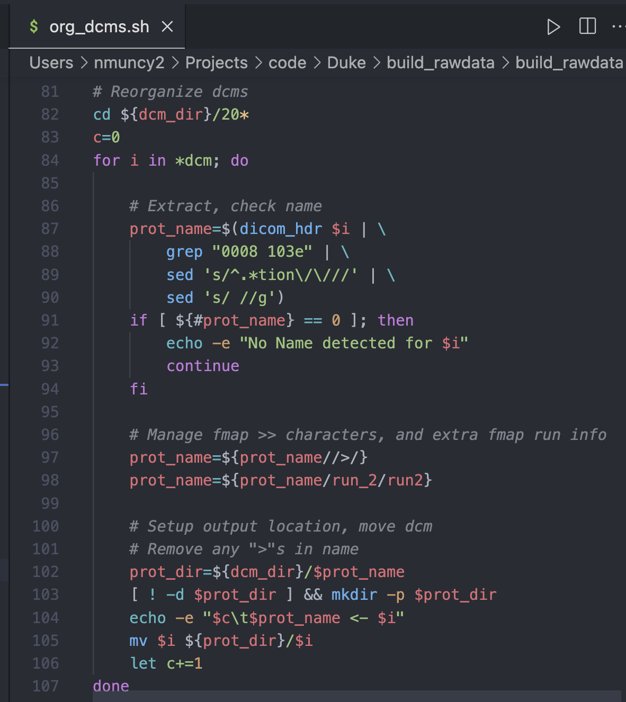{.fragment}
::::
:::::
::::::

## Create New Script

:::::: columns
::::: {.column width="50%"}
:::: {style="font-size: 65%;"}

- `touch`: Create new file
    - Update write-time for existing files
- `nano`: Create and open file with built-in editor
    - Other built-ins: vi, vim, emacs
    - Exit sequence:
        - `ctrl-x`: save and exit
        - `y`: overwrite
        - specify name, return
- Specify interpreter via `#!`
    - Provides path to executable

::::
:::::

::::: {.column width="\"50%"}
:::: {.r-stack}
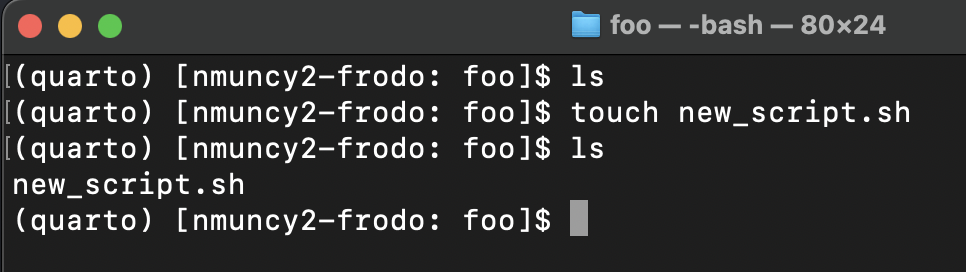{.fragment}

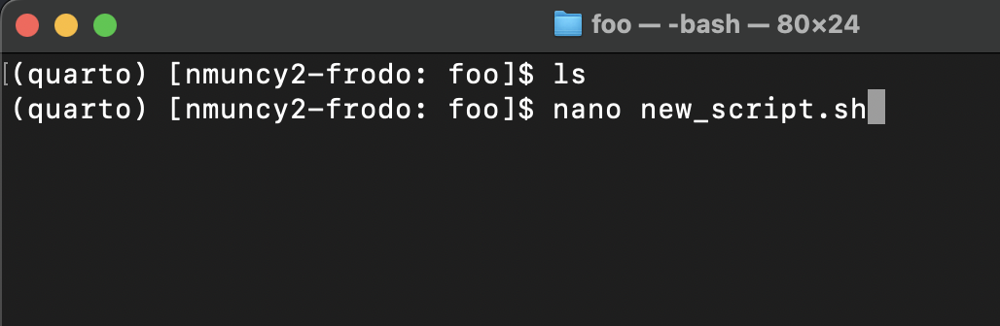{.fragment}

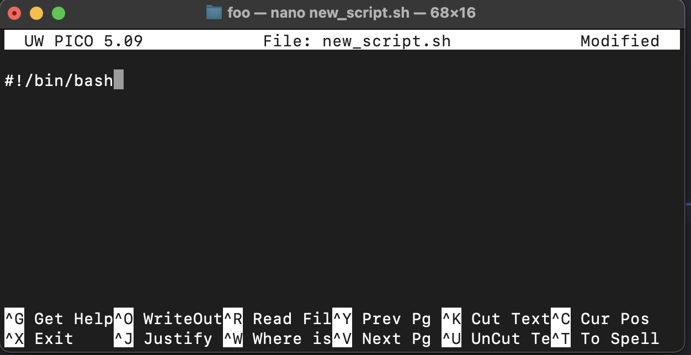{.fragment}

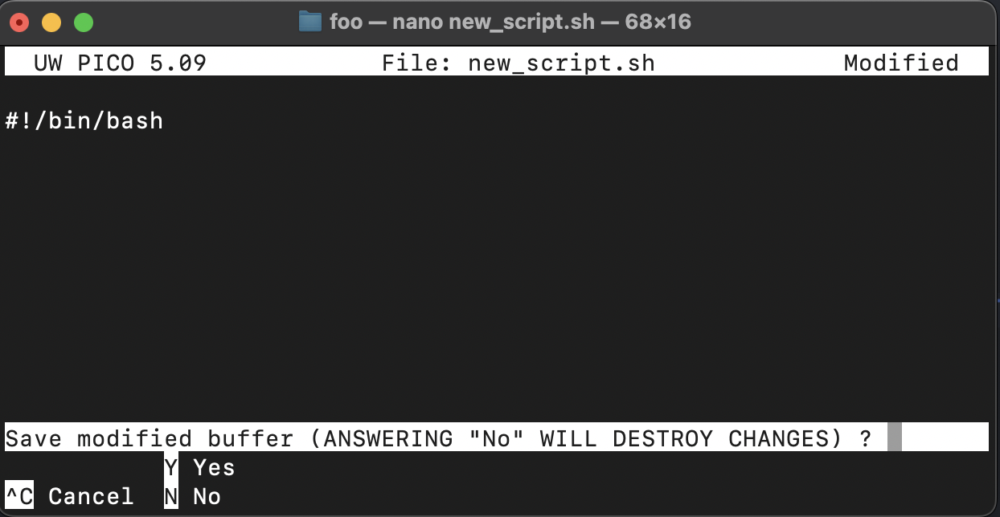{.fragment}

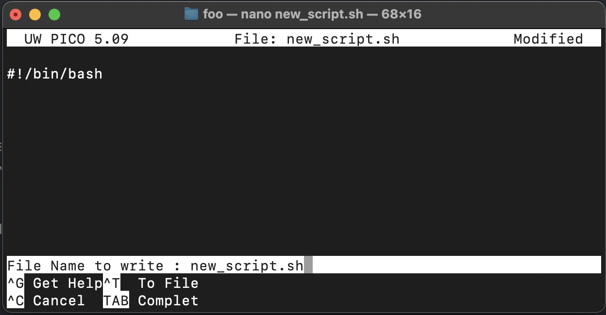{.fragment}

::::
:::::
::::::


## Add Commands

:::::: columns
::::: {.column width="50%"}
:::: {style="font-size: 65%;"}

- Specify series of commands
- Helpful - spend time to determine logic
- Save work for future use
- Back up work in case of tragedy

::::
:::::


::::: {.fragment .column width="\"50%"}
```{bash}
#| echo: true
#| message: true
#!/bin/bash

# Use positional slicing
alpha="abcdefg"
let_e=${alpha:4:1}
let_g=${alpha:6}
echo ${let_e}${let_g}${let_g}

# Use character slicing
beta="aaa-bbb_ccc"
int_var=${beta#*-}
echo ${int_var%_*}
```
:::::
::::::

## CHMOD

:::::: columns
::::: {.column width="50%"}
:::: {style="font-size: 65%;"}
- CHange MODe of files
- `ls -l` shows file permissions by group
    - User, group, other
- Numeric access (8 bit):
    - read (4), write (2), execute (1)
    - `rw-` = 6
    - `rwxr-xr-x` = 755
- `chmod 755 new_script.sh` - detail permission for each group
- `chmod +x new_script.sh` - assign execute to all groups

::::
:::::

::::: {.column width="\"50%"}
::: {layout-nrow="2"}

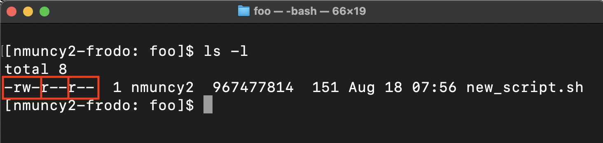

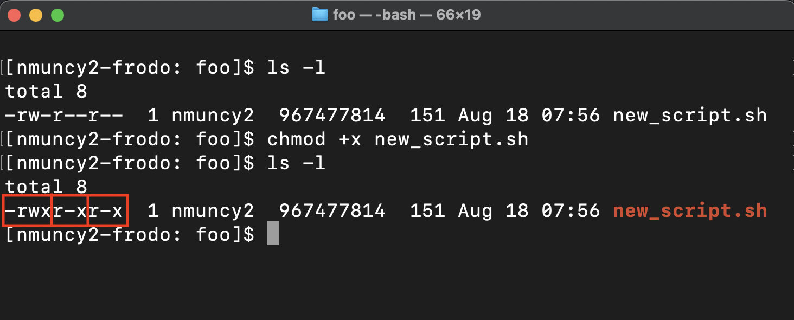{.fragment}

::::
:::::
::::::

## Execution

:::::: columns
::::: {.column width="50%"}
:::: {style="font-size: 65%;"}
- Execute in different shells
    - current vs sub shell
- Relevant for variable availability
- Method 1: source or dot execution
    - `source new_script.sh`
    - `. new_script.sh` is preferred
    - Executes script in current shell
    - Variables available for future use
    - Ideal for creating environments
    - Overrides permissions (discouraged)

::::
:::::

::::: {.column width="\"50%"}

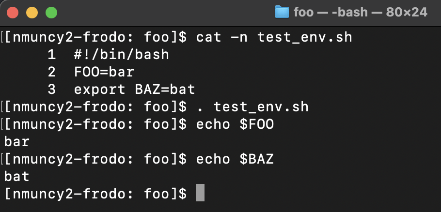{.fragment}

:::::
::::::

## Execution

:::::: columns
::::: {.column width="50%"}
:::: {style="font-size: 65%;"}
- Method 2: direct execution
    - `./new_script.sh`
    - Executes script in sub-shell
    - Variables only exist in sub-shell
    - Ideal for executing independent scripts
- Method 3: interpreter execution
    - `bash new_script.sh`
    - Executes script in specified shell
    - Discouraged, specify interpreter in script
::::
:::::

::::: {.column width="\"50%"}
::: {.r-stack}

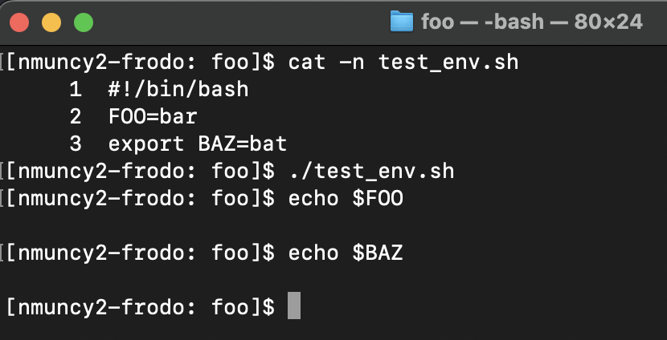{.fragment}

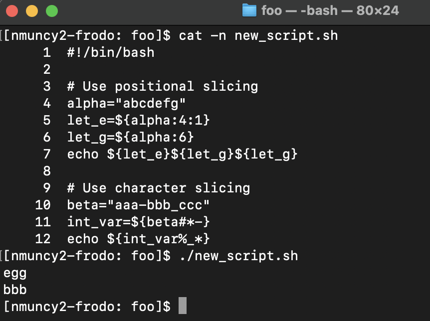{.fragment}

:::
:::::
::::::

## IDEs

:::::: columns
::::: {.column width="50%"}
:::: {style="font-size: 65%;"}
- Integrated Development Environments
- Editor: syntax highlighting, formatting, error detection
- Compiler or Interpreter: build and execute
- Extra features:
    - Testing
    - Debugging
    - Visualization
    - Remote Development
- Popular for Bash
    - [Sublime](https://www.sublimetext.com/download): simple text editor, "free"
    - [VS Code](https://code.visualstudio.com/download): IDE, plugins for languages, free for research and learning
::::
:::::

::::: {.column width="\"50%"}
::: {.r-stack}

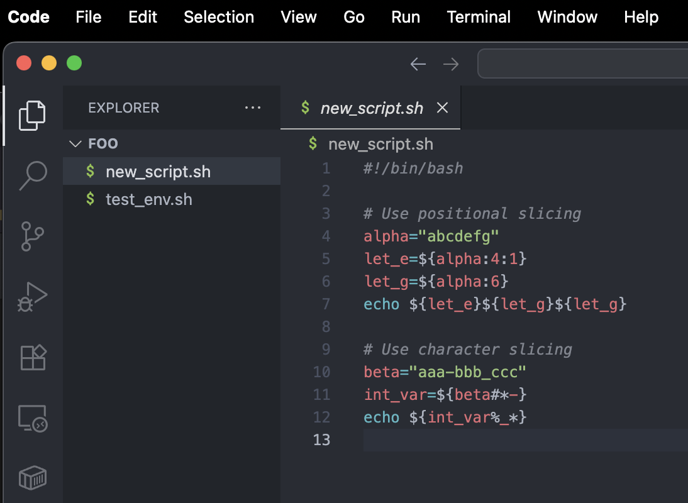{.fragment}

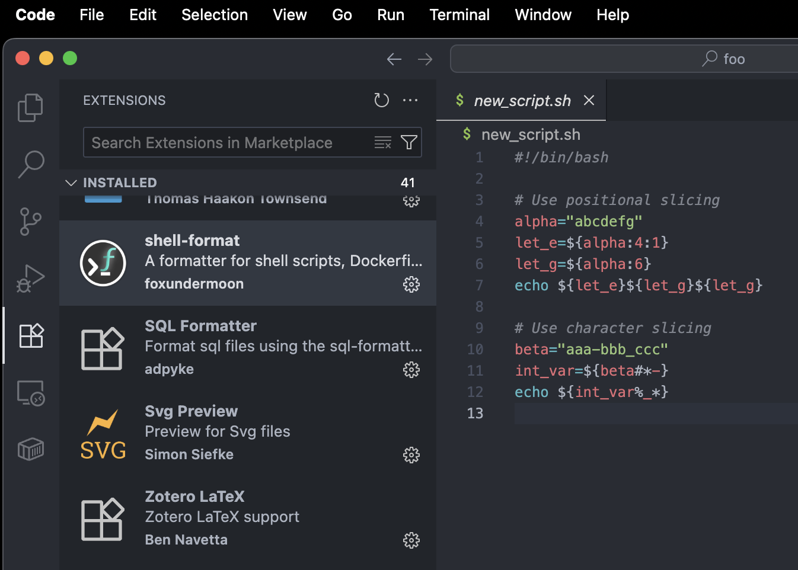{.fragment}

:::
:::::
::::::

## Style guides

:::: {style="font-size: 65%;"}
- Individual programming style - "Spaghetti Code"
    - Difficult to read, maintain, optimize
    - [xkcd comic](https://xkcd.com/1513/)
- **Strongly encourage** using style guides
    - [Google Style](https://google.github.io/styleguide/shellguide.html)
- Reasons:
    - Increases professionalism
    - Ability to collaborate
    - Access to plugins (autoformatter, linter, documentation)
    - Program faster
    - Reduce learning curve
::::