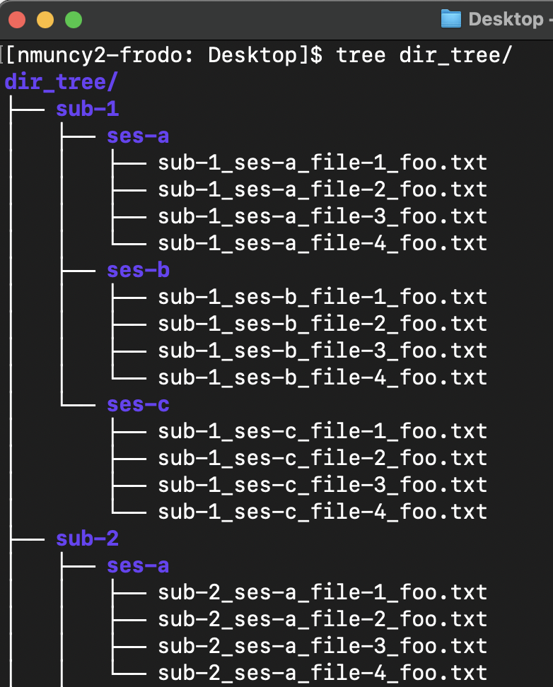
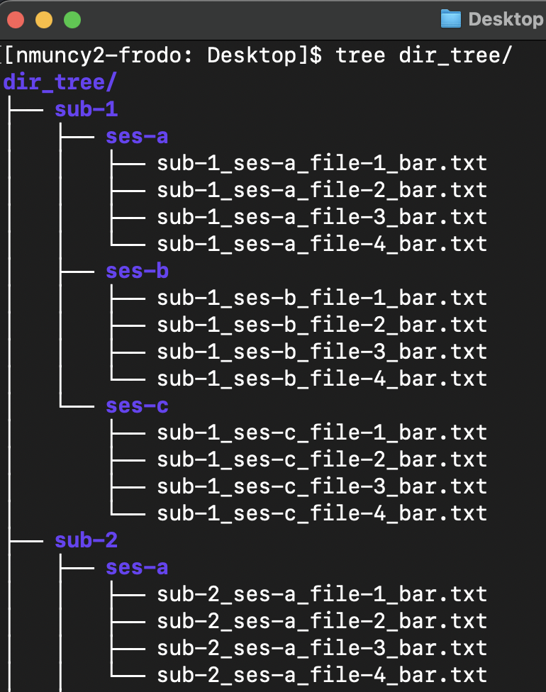
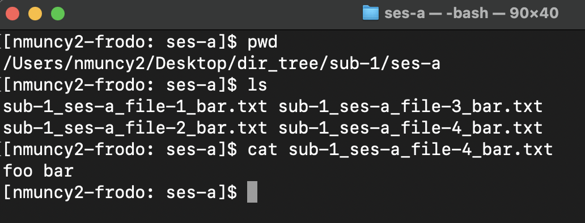

## Building file structures
<!-- for subj in sub-{1..5}; do for sess in ses-{a..c}; do mkdir -p ${subj}/$sess; for file in file-{1..4}; do touch ${subj}/${sess}/${subj}_${sess}_${file}_foo.txt; done; done; done -->
1. Write a script that uses nested for loops to create a directory structure with the following specifications:
    - Five subject directories named 'sub-1', 'sub-2' ... are at the top level
    - Each subject directory has three session directories (ses-a, ses-b, ses-c)
    - Each session directory has four files:
        - Files are named by subject, session, and file number
        - File suffix is 'foo.txt'
        - Underscores separate identifier fields
    - See @fig-1
<!-- for subj in sub-{1..5}; do for sess in ses-{a..c}; do for file in file-{1..4}; do file_old=${subj}/${sess}/${subj}_${sess}_${file}_foo.txt; echo "foo bar" > $file_old; mv $file_old "${file_old/foo/bar}"; done; done; done -->
1. Write another script that:
    - Replaces the 'foo' suffix to 'bar' (remember slice: replace from lecture 2)
        - Search "bash use mv to rename file"
    - Adds the string "foo bar" into the file
        - Search 'redirecting echo in bash'
    - See @fig-2 and @fig-3
1. Send these scripts to your instructor.

::: {style="text-align:center;"}
{width=50% #fig-1}

{width=50% #fig-2}

{width=50% #fig-3}
:::