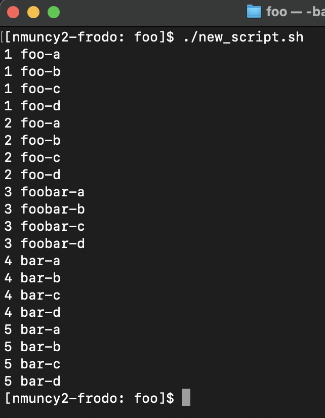
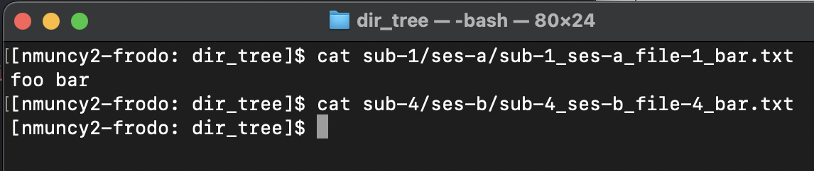
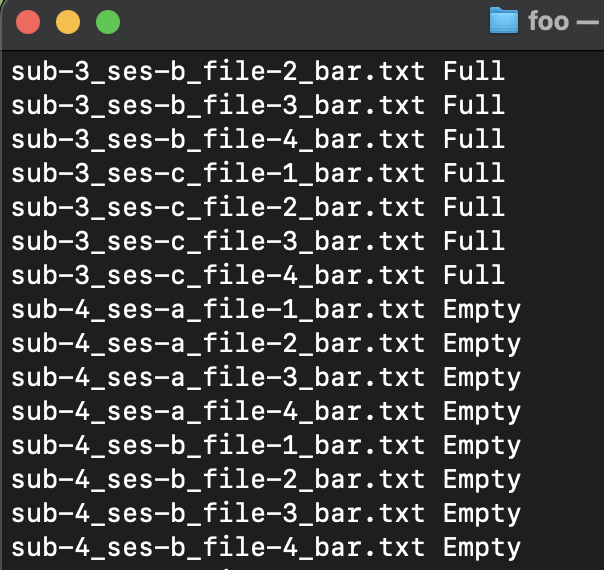

## Integrate for loops and conditionals
<!-- for num in {1..5}; do
    for alpha in {a..d}; do
        if [ $num -lt 3 ]; then
            echo $num foo-$alpha
        elif [ $num -eq 3 ]; then
            echo $num foobar-$alpha
        else
            echo $num bar-$alpha
        fi
    done
done -->
1. Write a script that uses nested for loops and conditional statements to produce the output in @fig-1.
<!-- for subj_num in {1..5}; do
    for sess in ses-{a..c}; do
        subj_sess=dir_tree/sub-${subj_num}/$sess
        mkdir -p $subj_sess
        for file in file-{1..4}; do
            file_path=${subj_sess}/sub-${subj_num}_${sess}_${file}_bar.txt
            touch $file_path
            [ $subj_num -lt 4 ] && echo "foo bar" > $file_path
        done
    done
done -->
1. Write a script that repeats the Lesson 4 [practice](../04-for_loops/04-practice.qmd) but only adds 'foo bar' to the text files of subjects 1-3 (see @fig-2).
<!-- work_dir=$(pwd)
for subj in sub-{1..5}; do
    for sess in ses-{a..c}; do
        subj_sess=dir_tree/${subj}/$sess
        cd $subj_sess
        for file in sub*; do
            [ -s $file ] && echo $file Full || echo $file Empty
        done
        cd $work_dir
    done
done -->
1. Write a script that loops through the directory structure made above to checks whether the text files have content. Print both the file name and whether the file is 'Empty' or 'Full' (see @fig-3).
1. Send these scripts to your instructor.

::: {style="text-align:center;"}

{width=50% #fig-1}

{#fig-2}

{width=50% #fig-3}

:::