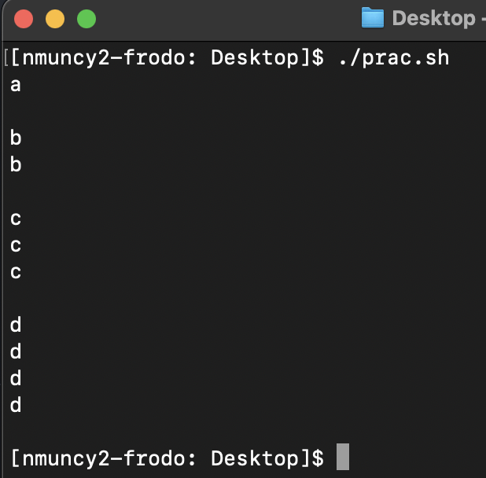
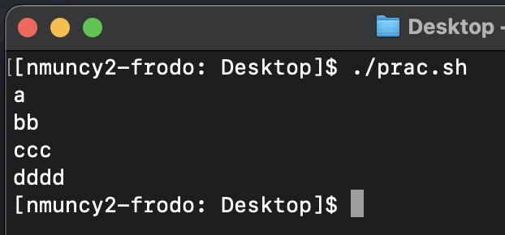

## Varying iterations
<!-- arr=({a..d})
for idx in ${!arr[@]}; do
    for ((cnt=0; cnt<=$idx; cnt+=1)); do
        echo ${arr[$idx]}
    done
    echo
done -->
1. Set an array to hold the letters a-d, then incorporate this array in a set of nested loops to generate the output in @fig-1.
<!-- arr=({a..d})
for idx in ${!arr[@]}; do
    unset alpha
    for ((cnt=0; cnt<=$idx; cnt+=1)); do
        alpha+="${arr[$idx]}"
    done
    echo $alpha
done -->
1. Incorporate the above array in a set of nested loops to generate the output in @fig-2.
1. Send these scripts to your instructor.

::: {style="text-align:center;"}

{width=50% #fig-1}

{width=50% #fig-2}

:::