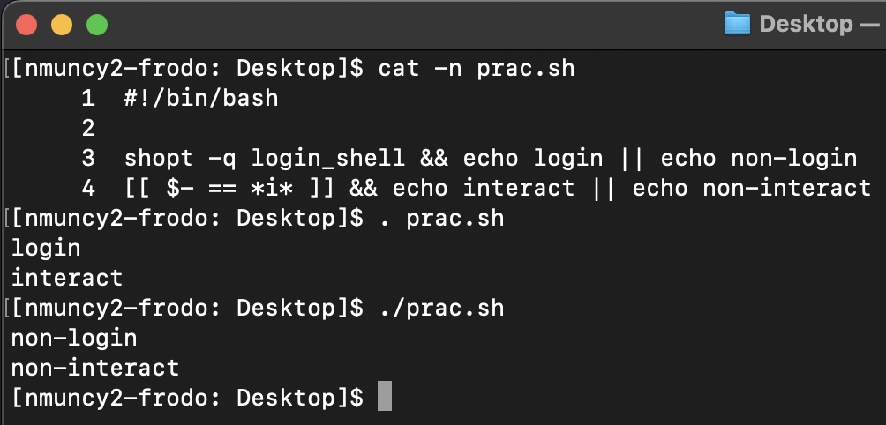
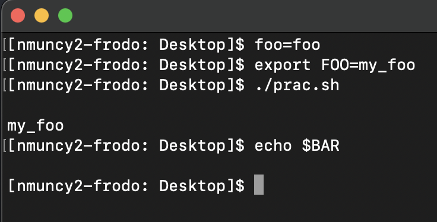
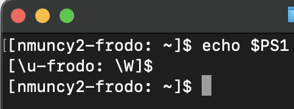
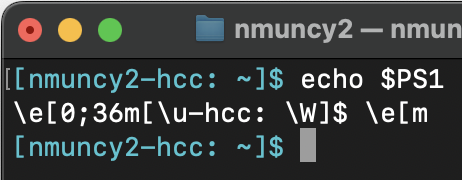

## Purpose

:::: {style="font-size: 65%;"}
- **Knowledge**: Learn about different shells and how to interact with them
- **Skill**:
    - Types of shells
    - Targeting shells
    - Global variables
    - Aliases
- **Why**:
    - Control information in workflows
    - Prepare for cluster computing
    - Increase user comfort
::::

## Environment Configuration

:::: columns
::: {.column width="50%" style="font-size: 65%;"}
- Three important build files in `$HOME`
    1. `.profile` (OSx)
    1. `.bash_profile`
    1. `.bashrc`
- Purpose
    - Establish shell environments
    - User customization
- Differ in relationship to shell types
:::
::::

## Shells: non/login

:::: columns
::: {.column width="50%" style="font-size: 65%;"}
- Login shell: Initiated when user logs into system
    - e.g. over SSH connection (cluster)
    - Builds from `~/.bash_profile` or `~/.profile`
- Non-login shell: Subsequent shells after login session
    - e.g. Terminal tabs, subshells
    - Builds from `~/.bashrc`
- Determine login shells status with `shopt -q login_shell`
:::

::: {.column width="\"50%" style="font-size: 80%;"}
```{bash}
#| echo: true
shopt -q login_shell && echo login \
    || echo non-login
```
:::
::::

## Shells: non/interactive

:::: columns
::: {.column width="50%" style="font-size: 65%;"}
- Interactive shell: Allows user to enter commands
    - Typical shell experience
    - Builds from  `~/.bashrc`
- Non-interactive shell: Does not receive commands
    - e.g. Subshells, commands executed through SSH tunnel
    - Subshells inherit environment
    - Log-in, non-interactive build from `~/.bash_profile`
- Determine interactive shells status with `$-`
    - Interactive shells contain "i"
:::

::: {.column width="\"50%" style="font-size: 80%;"}
```{bash}
#| echo: true
echo $-
[[ $- == *i* ]] && echo interact \
    || echo non-interact
```
:::
::::

## Complexity of config files

:::: columns
::: {.column width="50%" style="font-size: 65%;"}
- `.bash_profile`: keep simple due to login processes
    - common to execute `.bashrc` in current shell
    - `[ -f ~/.bashrc ] && . ~/.bashrc`
- `.bashrc`: user customizations
    - Update PATH
    - Set functions
    - Add aliases
:::

::: {.column width="\"50%" style="font-size: 80%;"}
```{bash}
#| echo: true
cat ~/.bash_profile | wc -l
cat ~/.bashrc | wc -l
```
:::
::::

## Executing code, revisited

::::: columns
:::: {.column width="50%" style="font-size: 65%;"}
- `source` or `.` executes in current shell
- `./` executes in non-login, non-interactive shell
    - AND copied environment from current shell
::::

:::: {.column width="\"50%" style="font-size: 80%;" .fragment}
::: {layout-nrow="2" .fragment}

```{bash}
#| echo: true
#| eval: false
#!/bin/bash
shopt -q login_shell && echo login \
    || echo non-login
[[ $- == *i* ]] && echo interact \
    || echo non-interact
```



:::
::::
:::::

## Executing code, more options

::::: columns
:::: {.column width="50%" style="font-size: 65%;"}
- `$(foo)` executes command `foo` in subshell
- `bash foo.sh` or `sh foo.sh` to execute script in language-specific subshell
- Remote execution in login, non-interactive shell
- **Point**: Relevant to remember ***how*** these shell environments build
    - (`.bashrc` vs `.bash_profile`)
::::

:::: {.column width="\"50%" style="font-size: 80%;"}
```{bash}
#| echo: true
#| eval: false
my_files=$(ls .)
ssh user@server.com "mkdir ~/test"
```
::::
:::::

## Global variables

::::: columns
:::: {.column width="50%" style="font-size: 65%;"}
- Variables only exist in definition shell
- Global variables: variables for current and subshells
- Defined with `export` and uses SCREAM_SNAKE_CASE
    - `export FOO_BAR=some_value`
- Useful for building environments
::::

:::: {.column width="\"50%" style="font-size: 80%;" .fragment}
::: {layout-nrow="2" .fragment}
```{bash}
#| echo: true
#!/bin/bash
echo $foo
echo $FOO
export BAR=my_bar
```


:::
::::
:::::

## Global variables: Building environments

::::: columns
:::: {.column width="50%" style="font-size: 65%;"}
- Important paths for workflows
    - Software
    - Templates
    - Singularity
    - Reference files
- Should be added to `.bashrc`
    - (e.g. `nano ~/.bashrc`)
- Rebuild shell to reflect changes
    - New, or '`. ~/.bashrc`'
- `env`: Print all globals
::::

:::: {.column width="\"50%" style="font-size: 80%;" .fragment}
```{bash}
#| echo: true
#| eval: false
export FSLDIR=/path/to/fsl/install
export TEMPLATEFLOW=/path/to/templateflow
export SING_FREESURFER=/path/to/freesurfer.simg
```
::::
:::::

## Global variables: PATH

::::: columns
:::: {.column width="50%" style="font-size: 65%;"}
- `PATH`: search locations for matching command to executable
- New software: update to PATH needed
    - `.bashrc` is common location, `.bash_profile` is *OK*
- Use `:` to separate locations
    - Better to append (beware trailing whitespace)
    - Avoid prepending (despite enthusiastic install tutorials)
- Command based on ***first*** match in PATH
::::

:::: {.column width="\"50%" style="font-size: 80%;" .fragment}
```{bash}
#| echo: true
#| eval: false
PATH=${PATH}:\
/path/to/soft/a:\
/path/to/soft/b:\
/path/to/soft/c

export PATH
```
::::
:::::

## Global variables: PS1

::::: columns
:::: {.column width="50%" style="font-size: 65%;"}
- Define, customize the command prompt
- Controls text and color, useful for tracking machines
    - `\u` for user
    - `\W` for current working directory
    - `PS1='[\u-machine: \W]$'`
- See [here](https://unix.stackexchange.com/questions/124407/what-color-codes-can-i-use-in-my-bash-ps1-prompt) for some color codes
    - Open color with `\e[color-code-m`
    - Close color with `\e[m`
    - `PS1='\e[color-codem[\u-machine: \W]$\e[m'`
- `.bashrc` is proper location

::::

:::: {.column width="\"50%" style="font-size: 80%;" .fragment}
::: {layout-nrow="2"}





:::
::::
:::::

## Aliases

::::: columns
:::: {.column width="50%" style="font-size: 65%;"}
- Avoid repeated typing by setting alias
- Anatomy:
    1. `alias`
    1. alias name
    1. command(s) in single quotes
    - `alias cdd='cd ~/Desktop; ls'`
- Should be added to `.bashrc`
    - Also common to make `~/.bash_aliases`
    - Remember to source file in `.bashrc`
- Avoid:
    - Using globals for aliases
    - Replacing existing commands (e.g. `cd`)
- `alias`: Print all aliases
::::

:::: {.column width="\"50%" style="font-size: 80%;" .fragment}
```{bash}
#| echo: true
#| eval: false
alias nb='nano ~/.bashrc'
alias sb='. ~/.bashrc'
alias cl='clear; ls'
alias my_proj='cd /to/my/project/dir; ls'
```
::::
:::::

## Style files (OSx)

::::: columns
:::: {.column width="50%" style="font-size: 65%;"}
- Ubuntu comes with file colors (check `.bashrc`)
    - Differentiate directories, executables, files
- Not the case in OSx
- Controlled with globals:
    - `CLICOLOR`: turn on/off colors
    - `LSCOLORS`: set colors for `ls` output
- Specify in `.bashrc`
::::

:::: {.column width="\"50%" style="font-size: 80%;" .fragment}
```{bash}
#| echo: true
#| eval: false
export CLICOLOR=1
export LSCOLORS=GxFxCxDxBxegedabagaced
```
::::
:::::