## Purpose

:::: {style="font-size: 65%;"}
- **Knowledge**: Learn how to access Notre Dame's compute cluster
- **Skill**:
    - Undestand how clusters differ
    - Make an account
    - Access account
    - Move data
- **Why**:
    - Process large datasets
::::

## Why learn to use a cluster

::: {style="font-size: 65%;"}
- Modern MRI: large data initiatives
    - Human Connectome Project (HCP)
    - Adolescent Brain Cognitive Development (ABCD)
    - Data repositories (OpenNeuro, NIMH, FITBIR)
- Need for larger sample sizes
- Complicated analytic pipelines
:::

## Description of cluster

::::: columns
::: {.column width="50%" style="font-size: 65%;"}
- The [Center for Research Computing](https://crc.nd.edu/) (CRC) provides cluster computing resources
    - Network of compute nodes (~8K CPUs) and RAM
- Their [Wiki](https://docs.crc.nd.edu/index.html) contains valuable resources for accessing, using cluster
- Main components
    1. Login point: manage data, submit requests
    1. Scheduler: index resources, manage request queue
    1. Cluster: CPUs and RAM
    1. Storage: file system
:::

:::: {.column width="\"50%"}
```{mermaid}
%%| fig-align: center
flowchart TB
  A[Work Machine] -- Internet --> B[Login Node]
  B -- Scheduler --> C[Cluster]
  B --> D[File Structure]
  C --> D
```
::: {.fragment style="font-size: 65%;"}
- Resist running processes on login node! They will be killed.
:::
::::
:::::

## Make an account
::::: columns
:::: {.column width="50%" style="font-size: 65%;"}
- Submit an account request [here](https://docs.crc.nd.edu/new_user/obtain_account.html)
    - Account approval may take a day
    - The instructor or your lab PI can endorse your account

::::

:::: {.column width="\"50%"}

::::
:::::

## Access account: terminal
::::: columns
:::: {.column width="50%" style="font-size: 65%;"}
- For off-campus access:
    - Install [Cisco AnyConnect](https://nd.service-now.com/nd_portal?id=kb_article_view&sys_kb_id=9f04e6b747fa2e5474aad08c346d437e)
    - Connect to Notre Dame's [VPN](https://nd.service-now.com/nd_portal?id=product_page&sys_id=9d5919c7db22a34099dcf25bbf9619e2&table=cmdb_ci_business_app%2F): `vpnaccess.nd.edu`
- Use terminal to login, with help from the [CRC Connection Resources](https://docs.crc.nd.edu/new_user/connecting_to_crc.html):
    - `ssh user@crcfe01.crc.nd.edu`
    - Use ND user ID and password
::::

:::: {.column width="\"50%"}
::: {layout-nrow="3"}
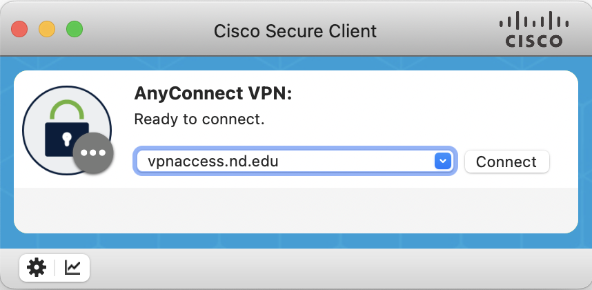{.fragment} 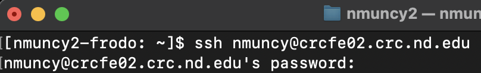{.fragment} 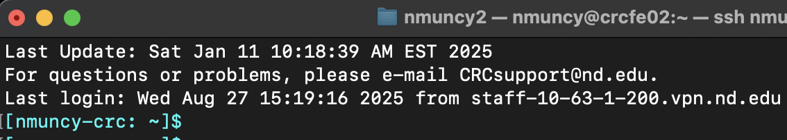{.fragment}
:::
::::
:::::

## Access account: web browser
::::: columns
:::: {.column width="50%" style="font-size: 65%;"}
- From a web browser go to `https://crcfe01.crc.nd.edu`
- Supply ND user ID and password
- Start a Graphical session
::::

:::: {.column width="\"50%"}
::: {.r-stack}
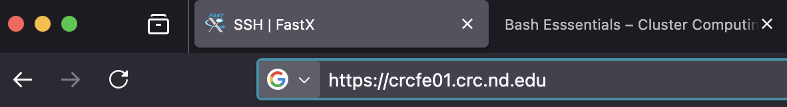{.fragment}

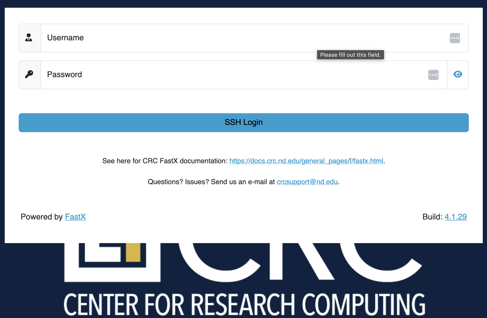{.fragment}

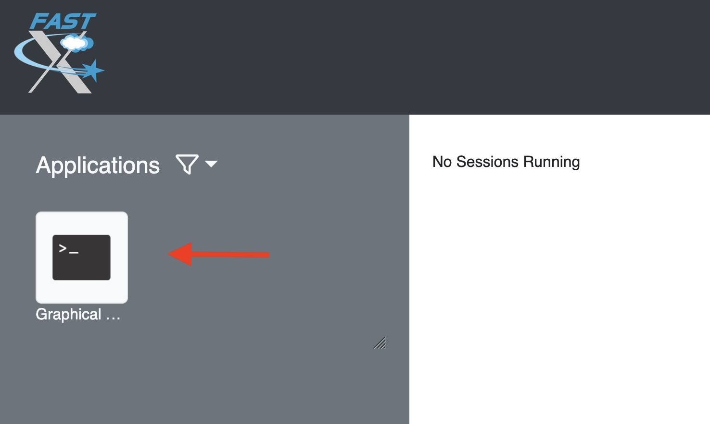{.fragment}

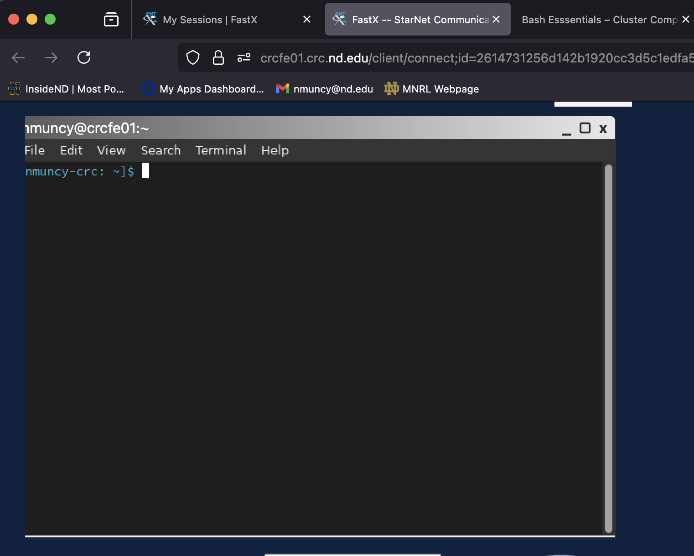{.fragment}
:::
::::
:::::

## Types of nodes - Front End
::::: columns
:::: {.column width="50%" style="font-size: 65%;"}
- Interactive, login nodes
    - [details](https://docs.crc.nd.edu/infrastructure/available_hardware.html#available-hardware)
    - `crcfe01` and `crcfe02`
    - 32 Cores, 256 GB RAM
    - Shared by ***all*** users
- Usage:
    - Login
    - Manage data
    - Development
- Do not lose your account!
::::

:::: {.column width="\"50%"}
::: {layout-nrow="3"}
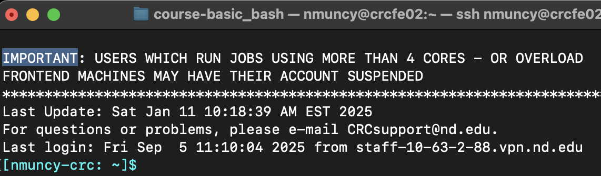{.fragment} 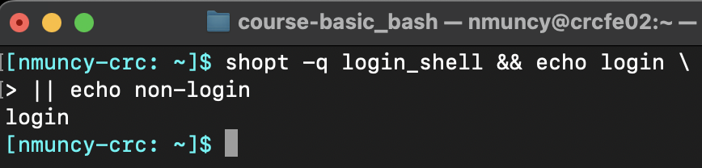{.fragment} 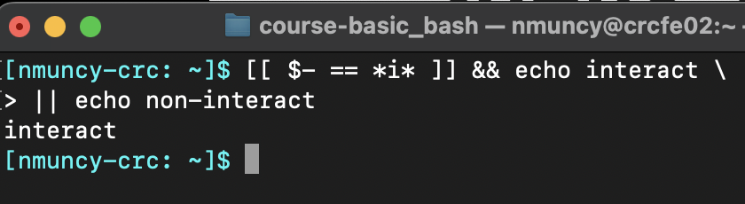{.fragment}
:::
::::
:::::

## Types of nodes - Back End
::::: columns
:::: {.column width="50%" style="font-size: 65%;"}
- Non-interactive, work nodes
    - [details](https://docs.crc.nd.edu/infrastructure/available_hardware.html#available-hardware)
    - 8200+ Cores
    - Controlled by [scheduler](https://docs.crc.nd.edu/new_user/quick_start.html#job-scripts)
- Usage:
    - Send work via [QSUB](https://docs.adaptivecomputing.com/torque/4-0-2/Content/topics/commands/qsub.htm) scheduler
    - Specify:
        - Type of processes (serial, parallel)
        - Queue type (long, gpu)
        - Job name
        - Work for scheduled nodes
::::

:::: {.column width="\"50%"}
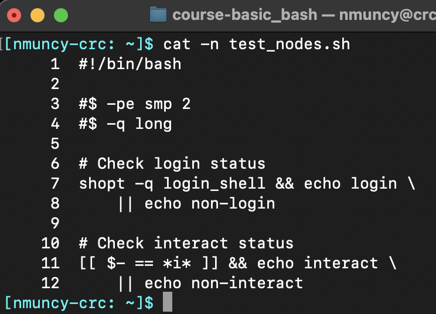{.fragment}

::: {.r-stack}
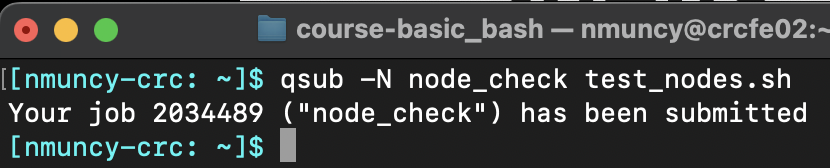{.fragment}

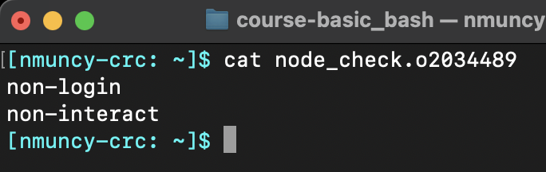{.fragment}
:::
::::
:::::

## File systems - AFS
::::: columns
:::: {.column width="50%" style="font-size: 65%;"}
- `home` managed by [AFS](https://en.wikipedia.org/wiki/Andrew_File_System)
- Users allocated 100GB for files
- `quota`: check total usage
- Purpose:
    - Small data
    - Code
    - Environments
- More info [here](https://docs.crc.nd.edu/new_user/quick_start.html#file-transfers) and [here](https://crcresearch.github.io/ndcmsT3/resources/ndcms/#storage)
::::

:::: {.column width="\"50%"}
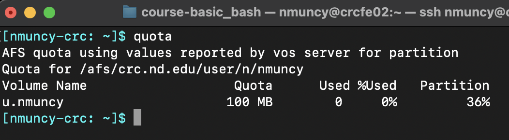
::::
:::::

## File systems - PANASAS
::::: columns
:::: {.column width="50%" style="font-size: 65%;"}
- `scratch` managed by [PANASAS](https://en.wikipedia.org/wiki/VDURA)
- Request access
    - Users allocated 250GB
    - Access at `/scratch365/userid`
- Purged yearly
- `pan_df`: check total usage
- Purpose:
    - Computing, intermediates
- More info [here](https://docs.crc.nd.edu/new_user/quick_start.html#file-transfers) and [here](https://crcresearch.github.io/ndcmsT3/resources/ndcms/#storage)
::::

:::: {.column width="\"50%"}
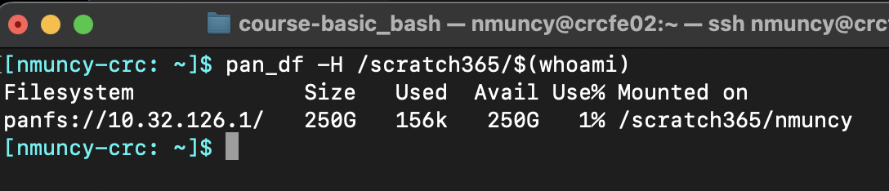
::::
:::::

## Moving data: scp

## Moving data: rsync

## Moving data: cyberduck