## Purpose
:::: {style="font-size: 65%;"}
- **Knowledge**: Learn to schedule flexible jobs
- **Skill**:
    - Pass and capture arguments
    - Redirect output and error messages
    - Build wrapper and job scripts
    - Submit and check jobs
- **Why**:
    - Deploy a common workflow for all subjects
    - Protect important scripts from requiring edits
::::

## Capture positional arguments

::::: columns
::: {.column width="50%" style="font-size: 65%;"}
- Recall anatomy of shell command:
    - `$ CMD OPT PARAM`
    - `$ mkdir -p foo/bar`
- Commands have 0-indexed positions
    - `0`: `mkdir`
    - `1`: `-p`
    - `2`: `foo/bar`
- Positional arguments can be accessed in scripts
    - Held in special variable `$[index]`
    - e.g. `$0`, `$1`, `$2` ...
:::

:::: {.column width="\"50%"}
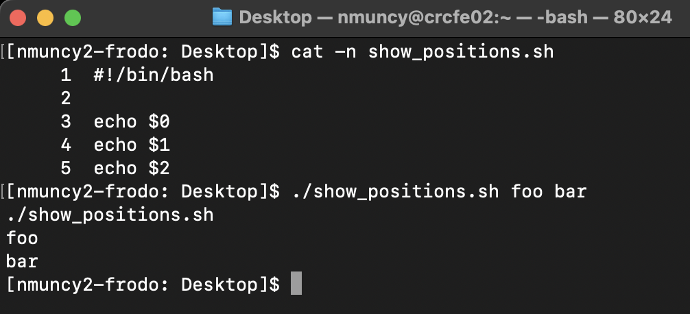{.fragment}
::::
:::::

## Use positional arguments

::::: columns
::: {.column width="50%" style="font-size: 65%;"}
- Assign positional argument to variable
- Use variable in script workflow
:::

:::: {.column width="\"50%"}
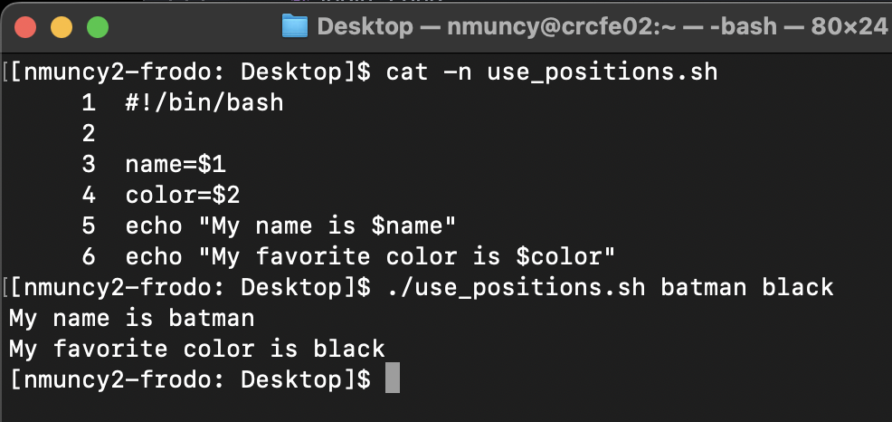
::::
:::::

## Redirect output: STDOUT

::::: columns
::: {.column width="50%" style="font-size: 65%;"}
- `STDOUT`: printed output of succesful jobs (exit status 0)
- Designated via `&1`
- Normally `&1` is the terminal window
- Can be redirected to a file with `>`
    - `>`: overwrites
    - `>>`: appends
:::

:::: {.column width="\"50%"}
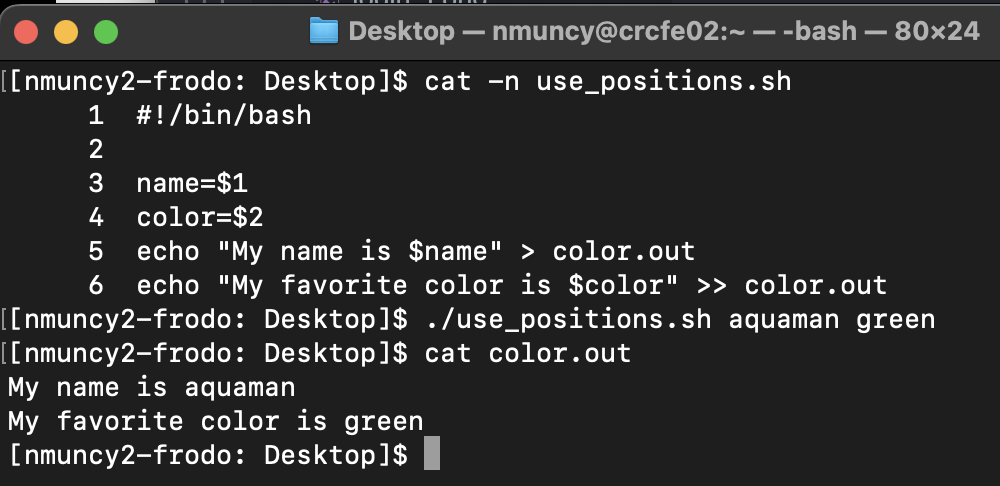
::::
:::::

## Redirect output: STDERR

::::: columns
::: {.column width="50%" style="font-size: 65%;"}
- `STDERR`: printed output of failed jobs (exit status >0)
- Designated via `2>`
- Normally `2>` is the terminal window
- Can be redirected to a file with `2>`
    - `2> err.log`: send STDERR to err.log
    - `2>&1`: send STDERR to same location as STDOUT
    - `cmd > out.log 2>&1`: Send STDOUT and STDERR to out.log
:::

:::: {.column width="\"50%"}
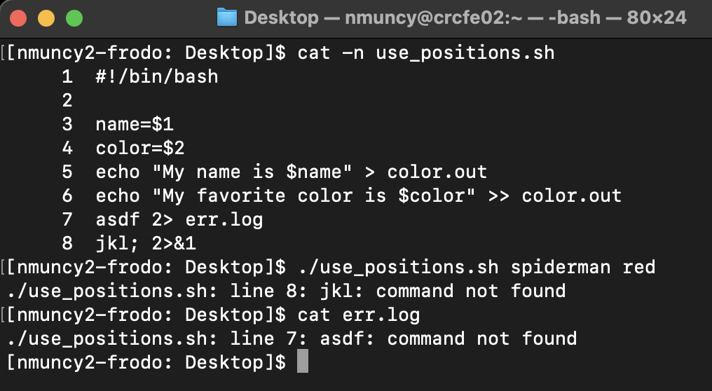
::::
:::::

## Job Scripts

::::: columns
::: {.column width="50%" style="font-size: 65%;"}
- Compute environments involved schedule jobs
    - e.g. execute workflow A for subjects 1, 2, and 3
- Inadvisable to edit job scripts for each subject
- Better - pass subject number to workflow script
- Job script:
    - Request resources
    - Receive arguments
    - Execute workflow
:::

:::: {.column width="\"50%"}
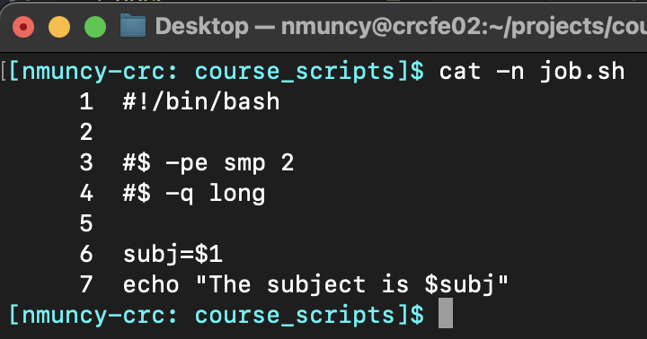
::::
:::::

## Wrapper Scripts

:::::: columns
::: {.column width="50%" style="font-size: 65%;"}
- Wrapper script:
    - Submits job script by envoking `qsub` command
    - Passes arguments to the job script
- Used as the researcher-editable file
    - No need to edit job script
- Could also pass args to wrapper script
    - (more advanced)
:::

::::: {.column width="\"50%"}
:::: {layout-nrow="3"}

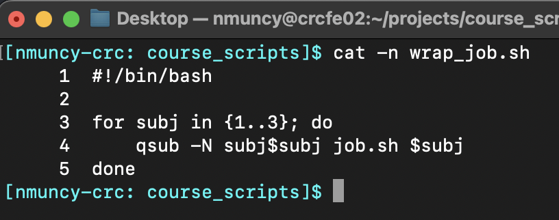

::: {.r-stack}

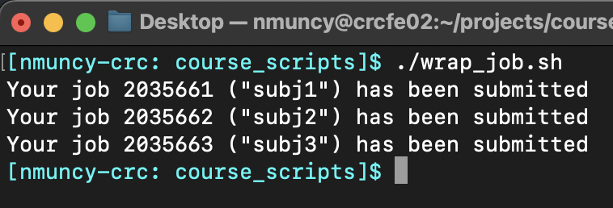{.fragment}

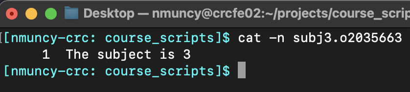{.fragment}

:::
::::
:::::
::::::

## Make log directory

::::: columns
::: {.column width="50%" style="font-size: 65%;"}
- Scheduled job runs on non-interactive node
    - STDOUT and STDERR are sent to `[job_name].o[job_id]`
- Redirect STDOUT and STDERR with `-o` and `-e` options
    - CRC `qsub` configuration directs `2>&1`
- Good habit to organize STDOUT/ERR in logging directory
    - Named for job
    - Time stamp helps trouble shoot
:::

:::: {.column width="\"50%"}
::: {.r-stack}
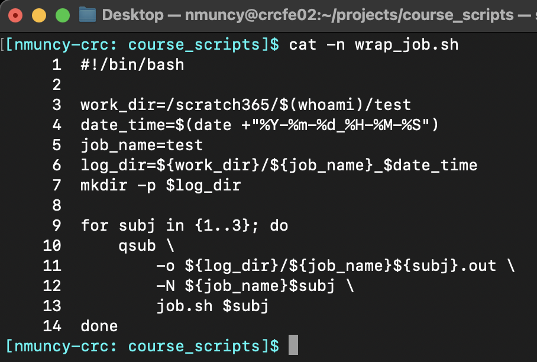

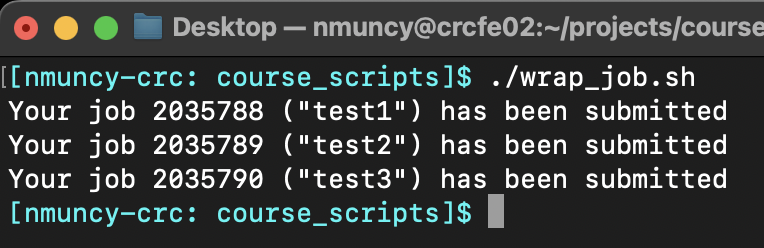{.fragment}

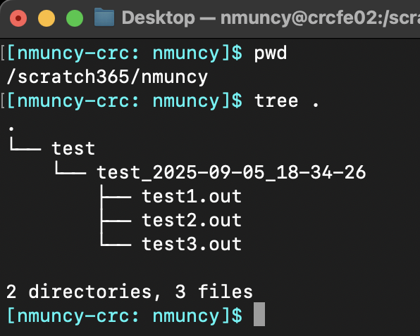{.fragment}

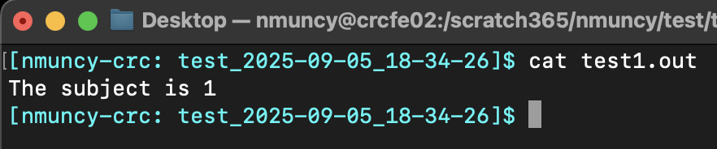{.fragment}
:::
::::
:::::

## Qstat, Qdel

## Available resources
