## Purpose
:::: {style="font-size: 65%;"}
- **Knowledge**: Learn to build and manage environments
- **Skill**:
    - Activate conda
    - Build and manage environments
    - Save and remove environments
- **Why**:
    - Manage software version dependencies
    - Work within a consistent environment
::::

## Need for conda

::: {style="font-size: 65%;"}
- Research involves specific software
    - As software develops, new versions function differently
    - Software suites often call on other suites
    - Software version can have specific hardware requirements
    - Together, a chance for [dependency hell](https://en.wikipedia.org/wiki/Dependency_hell)
- Projects take years:
    - Need to hold versions constant for on-going projects
    - Need to use newer versions for new projects
- Replication dependent on specific software versions
- [Conda](https://docs.conda.io/en/latest/) is a package and environment manager
    - Build environments with specific software versions
:::

## Conda on the CRC

:::::: columns
::: {.column width="50%" style="font-size: 65%;"}
- Conda is provided as a `module` on the CRC
    - See [here](https://docs.crc.nd.edu/popular_modules/conda.html) for their documentation
    - Find module via `module avail | grep conda`
- Activate conda via:
    1. `module load conda`
    1. `conda init`
    1. `source ~/.bashrc`
        - Why use `source` instead of `./`?
    1. `module unload conda`
- Verify via `conda info`

:::

::::: {.column width="\"50%"}
:::: {layout-nrow="2"}

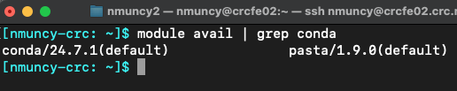{.fragment}

::: {.r-stack}
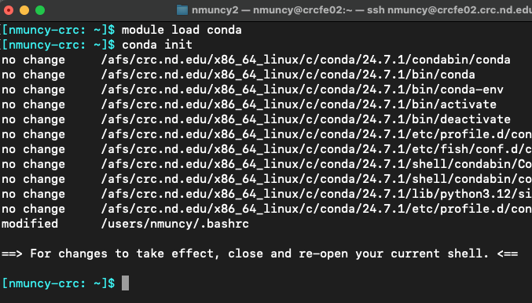{.fragment}

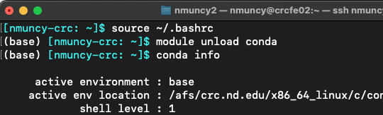{.fragment}
:::
::::
:::::
::::::

## Named environments

:::::: columns
::: {.column width="50%" style="font-size: 65%;"}
- Environments can be named
    - Purposes (e.g. python3.8, r4.1)
    - Projects (e.g. rest_fmri, proj_name)
- Use conda by envoking command `conda` and supply arguments
- `conda create -n test_name`: build named environment test_name
    - Note the build location in `~/.conda`
- `conda env list`: see available environments
- `conda activate test_name`: activate test_name enironment
- `conda deactivate`: exits environment
:::

::::: {.column width="\"50%"}
:::: {layout-nrow="2"}

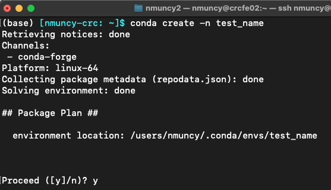{.fragment}

::: {.r-stack}

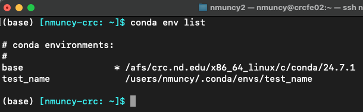{.fragment}

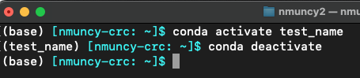{.fragment}

:::
::::
:::::
::::::

## Prefix (path) environments

:::::: columns
::: {.column width="50%" style="font-size: 65%;"}
- All named envs have paths
- Possible to make only prefixed (path) envs
    - Save env to specific location
    - Make env available to other users (e.g. RAs)
- `conda create -p ~/test_path`
- Note:
    - the build location
    - Absence of a name
- Activate by path
- ***Tip***: add `env_prompt: '({name})'` to .condarc to only see the name of env (and not full path)
:::

::::: {.column width="\"50%"}
:::: {layout-nrow="2"}

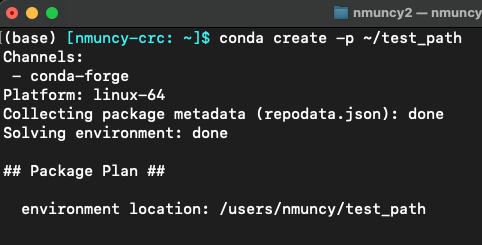{.fragment}

::: {.r-stack}

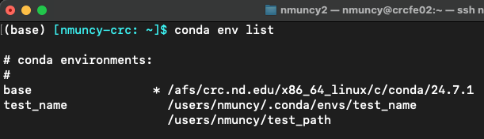{.fragment}

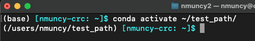{.fragment}

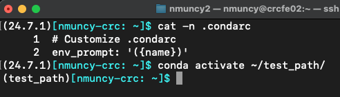{.fragment}

:::
::::
:::::
::::::

## Installing packages

:::::: columns
::: {.column width="50%" style="font-size: 65%;"}
- `conda list`: show packages installed in current env
- `conda install`: install specific package name
    - Default is to search for package at [conda-forge](https://conda-forge.org/)
- `conda install -c conda-forge python=3.10`: install python version 3.10 from conda-forge repository into current env
- ***Note***: strength of conda - also installs dependencies!
    - And manages versions if conflicts arise
    - Only when installed through `conda`, not other package managers (e.g. `pip`)

:::

:::: {.column width="\"50%"}
::: {.r-stack}

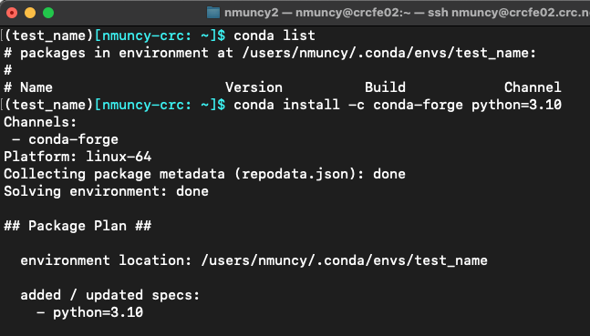{.fragment}

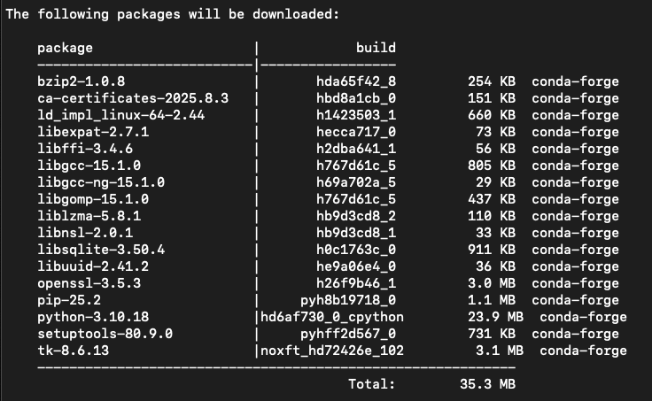{.fragment}

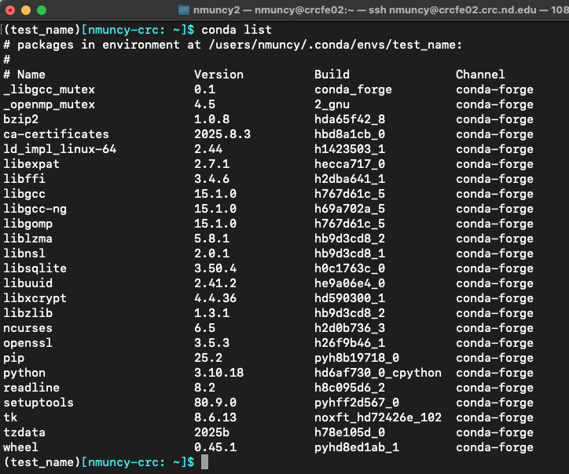{.fragment}

:::
:::::
::::::

## Multiple environments

:::::: columns
::: {.column width="50%" style="font-size: 65%;"}
- Environments do not conflict with each other
- Separate environments allow for separate software versions
- Applicable to Python, R, Java, C, C++, and others
- Useful for differing projects!
- ***Recommendation***: one environment per project
    - Allows to lock in versions
    - Enables newer versions for newer projects
:::

:::: {.column width="\"50%"}

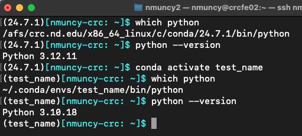

:::::
::::::

## Exporting environments

:::::: columns
::: {.column width="50%" style="font-size: 65%;"}
- Saving environment:
    - Backup
    - Share with collaborators
    - Add to code repository
- `conda env export > env_name.yml`: save environment as [YAML](https://www.redhat.com/en/topics/automation/what-is-yaml) file
    - Preferred method
- `conda list --explicit > env_name.txt`: save environment sources as text file
    - Not as robust
- Environments can be built from files using the `-f` option (see [here](https://docs.conda.io/projects/conda/en/stable/user-guide/tasks/manage-environments.html))
:::

:::: {.column width="\"50%"}

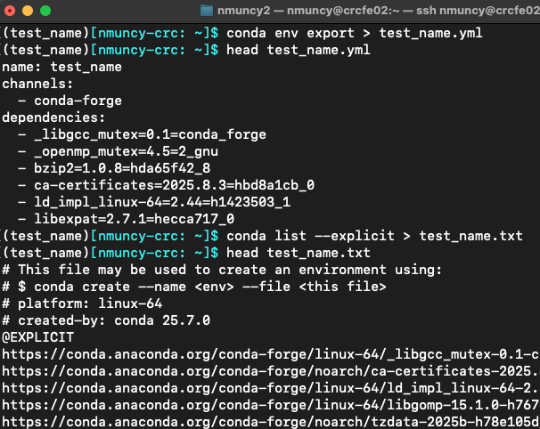

:::::
::::::

## Deleting environments

:::::: columns
::: {.column width="50%" style="font-size: 65%;"}
- Clean unused environments
    - Can always rebuild from backup file
    - (Assuming versions work on hardware or OS version)
- Removal is similar to creation
    - `conda env remove -n test_name`: remove named env test_name
    - `conda env remove -p ~/test_path`: remove previx env test_path
:::

:::: {.column width="\"50%"}
::: {layout-nrow="2"}
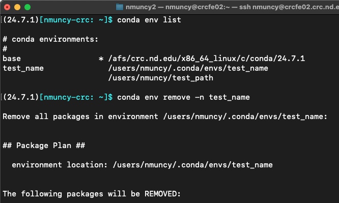{.fragment} 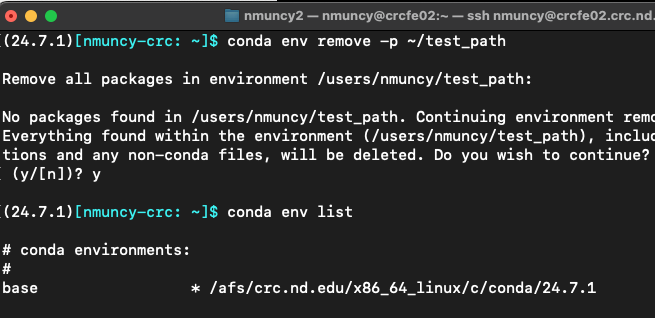{.fragment}
:::
:::::
::::::