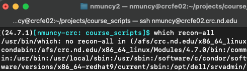
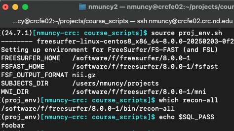
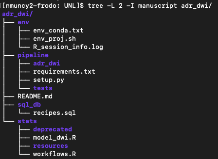

## Purpose
:::: {style="font-size: 65%;"}
- **Knowledge**: Build project environments
- **Skill**:
    - Construct environment build file
    - Centralize conda envs
- **Why**:
    - The ability to manage conda envs and global variables across projects
::::

## Need for project environments

::: {style="font-size: 65%;"}
- MRI software often requires:
    - Global variables
        - FreeSurfer: `SUBJECTS_DIR`, `FREESURFER_HOME`, `FS_LICENSE`
        - FSL: `FSLDIR`
        - fMRIPrep: `TEMPLATEFLOW_HOME`
    - Binary access in PATH
        - AFNI, FSL, c3d, ANTs
- Conflicts arise between on-going and new projects
    - *OK* solution: change .bashrc when switching projects
    - ***Better*** solution: build project environment from script
- Utility: project environment build script can be shared and versioned
:::

## Contents of project environments

:::: columns
::: {.column width="50%" style="font-size: 65%;"}
- Load modules
- Software versions
- Software configuration
- PATH updates
- Conda activation
- Project globals
- User messages
:::

::: {.column width="\"50%" style="font-size: 65%;"}
```{bash}
#| echo: true
#| eval: false
#!/bin/bash

# Load, configure FreeSurfer
module load freesurfer/8.0
export SUBJECTS_DIR=/users/$(whoami)/projects
export FS_LICENSE=/users/$(whoami)/research_bin/license.txt
mkdir -p $SUBJECTS_DIR
source $FREESURFER_HOME/SetUpFreeSurfer.sh

# Update path
PATH=${PATH}:\
/users/$(whoami)/research_bin

export PATH

# User globals
SQL_PASS=$(cat ~/.ssh/pass_sql)
RSA_WS=~/.ssh/id_rsa_ws

# Load project conda env
conda activate proj_env
```
- Following this example will require a FreeSurfer [License](https://surfer.nmr.mgh.harvard.edu/fswiki/License) stored at the appropriate location.
:::
::::

## Access environments

:::::: columns
::: {.column width="50%" style="font-size: 65%;"}
- Activate via `source`
    - Proj environment configuration is available to all subshells
    - E.g. scheduled jobs - no longer need to manage module across multiple job files!
- Personal preference: set an `alias` to activate environments
:::

::::: {.column width="\"50%"}
:::: {layout-nrow="2"}
{.fragment} {.fragment}
::::
:::::
::::::

## Save and share

:::: columns
::: {.column width="50%" style="font-size: 65%;"}
- Save environment script somewhere useful
    - Preferably in 'env' directory of code base
    - Versioning helps reproducibility and replicability
:::
::: {.column width="\"50%"}



:::
::::