## Purpose
::: {style="font-size: 65%;"}
- **Knowledge**: Include Git and GitHub in your development workflow
- **Skill**:
    - Connect local Git to GitHub
    - Track changes
- **Why**:
    - Foundational skillset for research and industry
    - Protect your code, facilitate maintenance and simultaneous development
:::

## Git

:::: columns
::: {.column width="50%" style="font-size: 65%;"}
- [Git](https://git-scm.com/) is software designed to track changes
    - "Who did what and when"
    - Resolved version control problems on collaborative projects
- Monitors requested directories and files
    - Creates a log of what changed and how
- Control Git with a series of simple commands
- Native in Linux distributions
    - Need to install in [Windows, Mac](https://git-scm.com/downloads)
:::

::: {.column width="\"50%" style="font-size: 50%;"}


:::
::::

## GitHub

:::: columns
::: {.column width="50%" style="font-size: 65%;"}
- [GitHub](https://github.com/) is a centralized platform
- Allows developers to create, store, manage, share their code
- Great for research:
    - Redundancy
    - Transparency
    - Collaboration
    - Internal reliability
    - External replicability
- Create an [account](https://github.com/signup)
:::

::: {.column width="\"50%" style="font-size: 50%;"}


:::
::::

## Setup: CRC

:::: columns
::: {.column width="50%" style="font-size: 65%;"}
- Git provided with default login shell
- Need to:
    - Configure git for your user
    - Connect git to your GitHub account
:::

::: {.column width="\"50%" style="font-size: 50%;"}

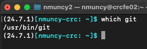

:::
::::

## Setup: config files

:::: columns
::: {.column width="50%" style="font-size: 65%;"}
- Create config file: `~/.gitconfig`
- Copy provided code to `~/.gitconfig`
    - Whitespace (tabs) included
    - Provide your name (will be added to git logs)
    - Provide email address (will be added to git logs)
- Many config options [available](https://git-scm.com/book/en/v2/Customizing-Git-Git-Configuration), we will keep it simple here
:::

::: {.column width="\"50%" style="font-size: 65%;"}
```{bash}
#| echo: true
#| eval: false
[credential]
	helper = store
[user]
	name = <your name>
	email = <your github email>
```
:::
::::

## Setup: credential 1

:::: columns
::: {.column width="50%" style="font-size: 65%;"}
- Goal:
    1. Create GitHub Personal Access Token ([PAT](https://en.wikipedia.org/wiki/Personal_access_token))
    1. Add PAT to CRC
    - More info [here](https://docs.github.com/en/authentication/keeping-your-account-and-data-secure/managing-your-personal-access-tokens)
- Login to GitHub
- Navigate to user Settings
:::

::: {.column width="\"50%"}

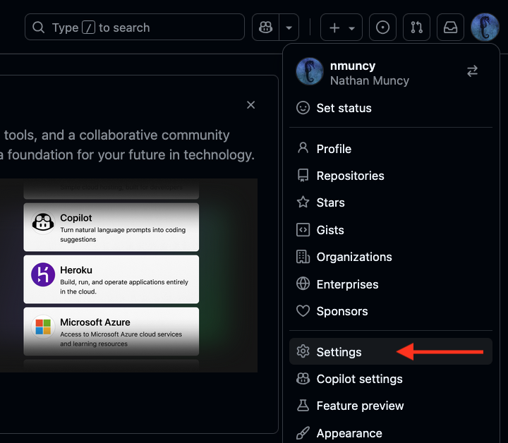

:::
::::

## Setup: credential 2

::::: columns
::: {.column width="50%" style="font-size: 65%;"}
- Navigate on the left to "Developer settings"
    - (Bottom of list)
:::

::: {.column width="\"50%"}

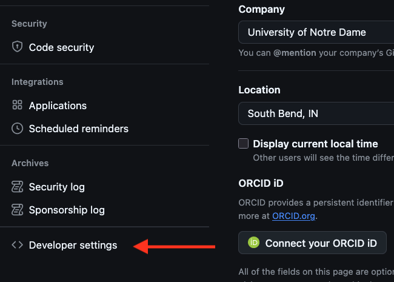

:::
:::::

## Setup: credential 3

::::: columns
::: {.column width="50%" style="font-size: 65%;"}
- Under "Personal access tokens" select "classic"
:::

::: {.column width="\"50%"}

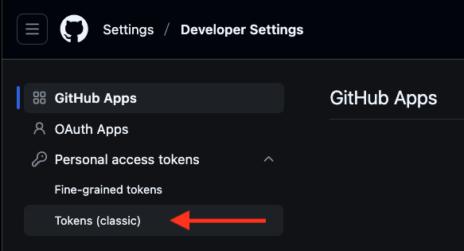

:::
:::::

## Setup: credential 4

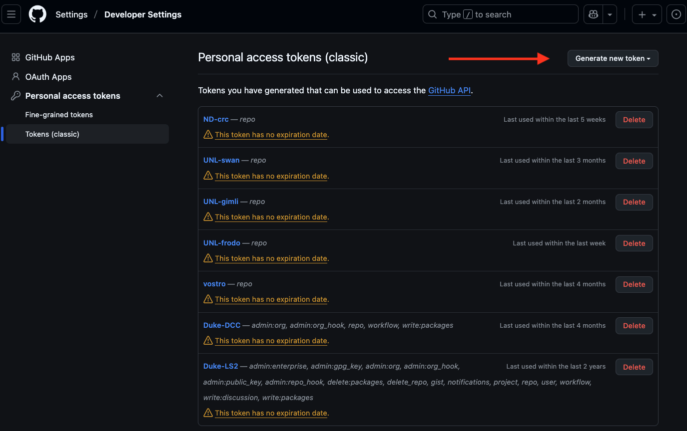

::: {style="font-size: 65%;"}
- ***Tip 1***: Name tokens after instutitions or machines for easy management
- ***Tip 2***: Do not follow my bad example on expiration dates
:::

## Setup: credential 5

::::: columns
::: {.column width="50%" style="font-size: 65%;"}
- Generate new token
    - Give a useful Note (or name)
    - Set expiration date
    - Only "repo" Scope needed
:::

:::: {.column width="\"50%"}
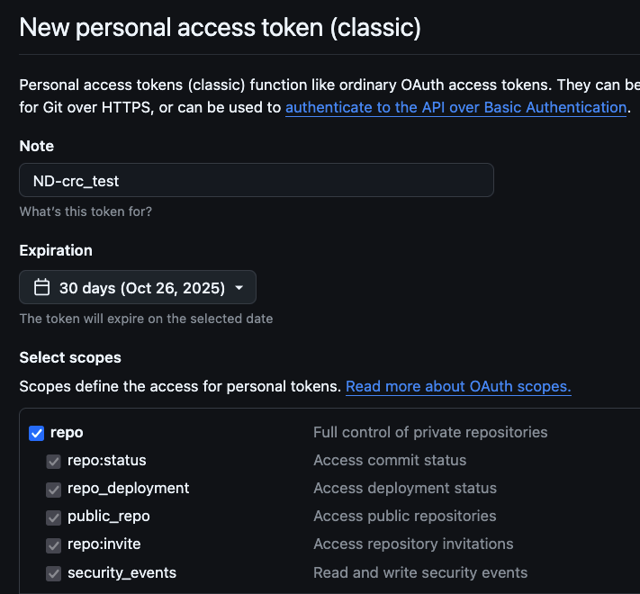
::::
:::::

## Setup: credential 6

::::: columns
::: {.column width="50%" style="font-size: 65%;"}
- Generate token
- Next screen contains token string
    - ***Note***: this is only available while this tab is open!
    - Once this page is refreshed, the token will be unavailable
- The PAT is used instead of an account password
    - **ANY** machine or person with the PAT can make edits
    - Is it secret, is it safe?
:::

:::: {.column width="\"50%"}
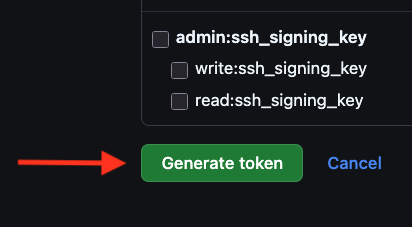

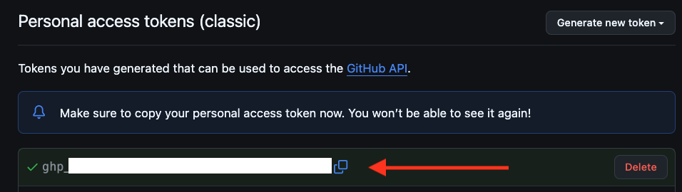
::::
:::::

## Setup: credential 7

:::: columns
::: {.column width="50%" style="font-size: 65%;"}
- Log into your CRC cluster account
- Create credential file: `~/.git-credentials`
- Add your user and credential in format:
    - `https://<user>:<PAT>@github.com`
- You're done!
:::

::: {.column width="\"50%"}
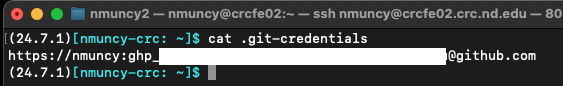

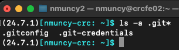
:::
::::

## Create repository

:::: columns
::: {.column width="50%" style="font-size: 65%;"}
- [Repository](https://docs.github.com/en/repositories/creating-and-managing-repositories/about-repositories): directory of files with git tracking logs
- Possible: create locally with `git init`
- Easier: make on GitHub
    - Bring locally via `git pull`

:::

::: {.column width="\"50%"}

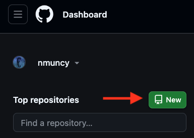

:::
::::

## Configure repository

::::: columns
::: {.column width="50%" style="font-size: 65%;"}
- Select an informative name
- Supply a description
- Select private vs public repo
- Add a README so the repo has a file

:::

::: {.column width="\"50%"}

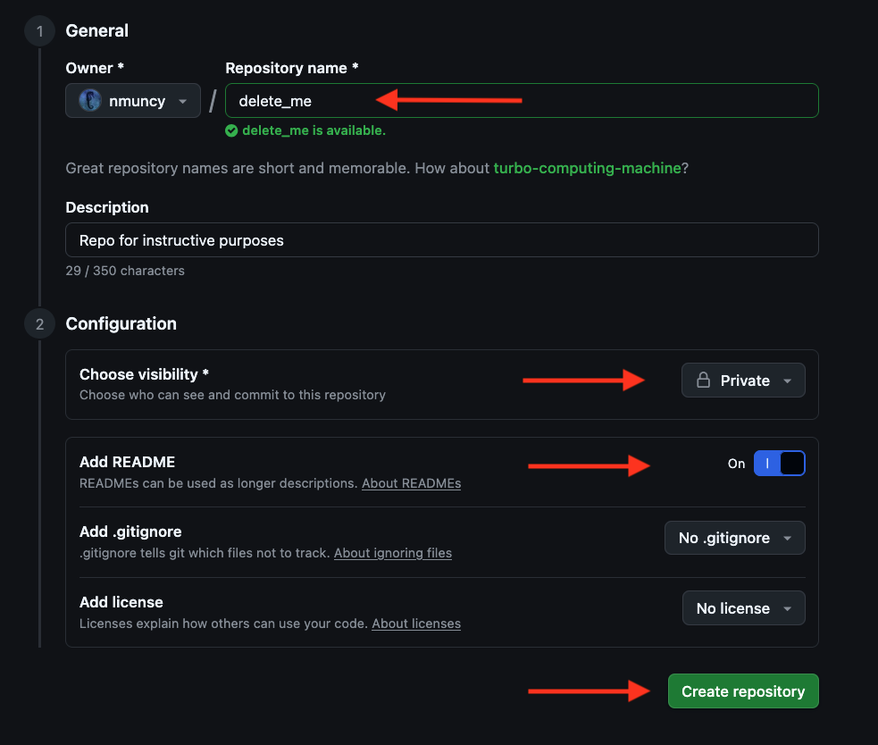

:::
:::::

## View repository

:::: columns
::: {.column width="50%" style="font-size: 65%;"}
- First items to note:
    - Task bar for managing project (code, pull requests, etc)
    - Identification of branches
    - Green code: download or clone help
    - List of files (only README here)
:::

::: {.column width="\"50%"}

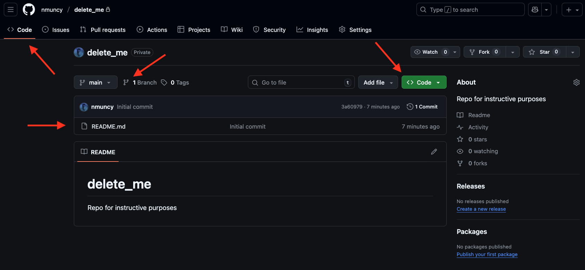

:::
::::

## Pull repository

## Add files

## Track

## Stage

## Commit

## Push