## Purpose
::: {style="font-size: 65%;"}
- **Knowledge**: Coordinate development
- **Skill**:
    - Develop on branches
    - Send and manage pull requests
- **Why**:
    - Foundational skillset for research and industry
    - Protect your code, facilitate maintenance and simultaneous development
    - Organize development for yourself, a team
:::

## Motivation

:::: columns
::: {.column width="50%" style="font-size: 65%;"}
- Often need to change codebase for development, maintenance, or refactoring
- Strong desire to not break code that works
- Git facilitates isolated changes
:::

::: {.column width="\"50%"}
```{mermaid}
flowchart TB
  A[Develop] --> B{Test}
  B --> C[Deploy]
  B <--> D[Maintenance]
  B <--> E[Refactor]
```
:::
::::

## Commit history

:::: columns
::: {.column width="50%" style="font-size: 65%;"}
- Each commit adds to the `log` or commit history
- `HEAD`: most recent commit
- Conceptualize: vine growing from tip
:::

::: {.column width="\"50%"}
```{mermaid}
flowchart LR
  A(cmt1) --> B(cmt2) --> C(cmt3/HEAD)
```
:::
::::

## Branching history

:::: columns
::: {.column width="50%" style="font-size: 65%;"}
- Split the commit history with a branch
- Changes are maintained to each branch
- Best practice:
  - `main` branch kept clean, working
  - New branch for additions, maintenance, refactors etc
:::

::: {.column width="\"50%"}
```{mermaid}
flowchart LR
  A(cmt1) --> B(cmt2) --> C(cmt3/HEAD)
  B --> D(cmt4) --> E(cmt5)
```
:::
::::

## Branch: make

:::: columns
::: {.column width="50%" style="font-size: 65%;"}
- `git branch`: determine current branch
- `git branch foo`: create branch "foo"
- `git checkout foo`: switch to branch "foo"
- Best practice - label branches for purpose:
  - dev-feat_a
  - fix-that_bug
  - ref-module_b
:::

::: {.column width="\"50%"}
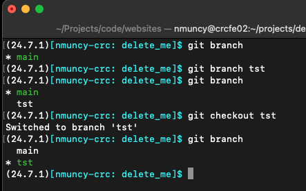
:::
::::

## Branch: modify files

:::: columns
::: {.column width="50%" style="font-size: 65%;"}
- New files can now be added to branch
- Existing files can be modified
- New commits are specific to branch
- Note log demonstrates:
  - Branch creation
  - Separate commit history
:::

:::: {.column width="\"50%"}
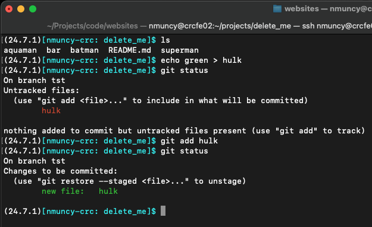
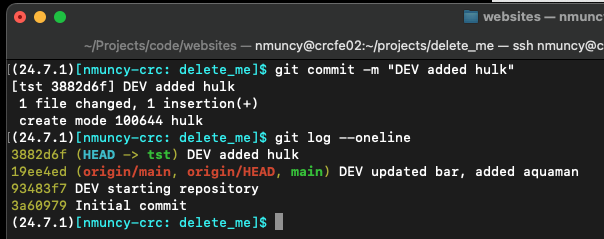
::::
:::::

## Branch: compare

:::: columns
::: {.column width="50%" style="font-size: 65%;"}
- Untracked files available to all branches
- Tracked (added, committed) files exist only on branch
:::

::: {.column width="\"50%"}
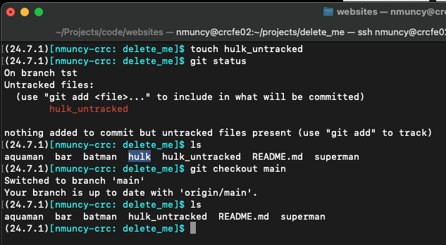
:::
::::

## Branch: push

:::: columns
::: {.column width="50%" style="font-size: 65%;"}
- Intend to send modifications to origin
- Issue: branch does not exist at origin
- Solution: build branch at origin (upstream), then push branch
  - `git push --set-upstream origin <name>`
- Verify at origin (GitHub)
:::

::: {.column width="\"50%"}
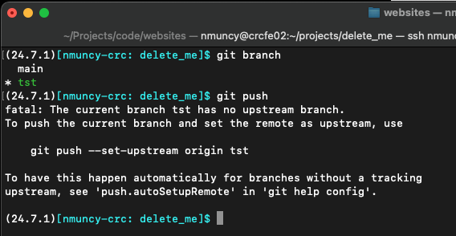
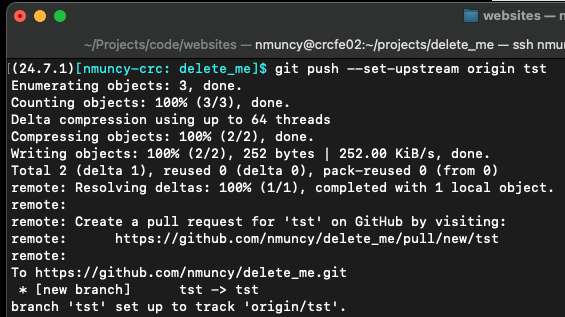
:::
::::

## Branch: verify
::::: columns
::: {.column width="50%" style="font-size: 65%;"}
- Verify at origin (GitHub)
- Multiple branches
- Different files, modifcations on branches
:::

:::: {.column width="\"50%"}
::: {.r-stack}
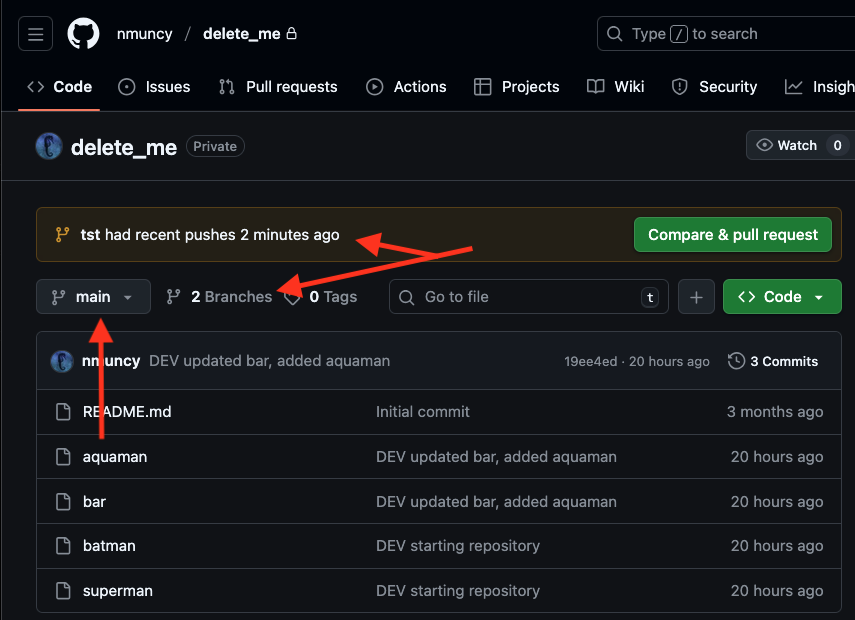

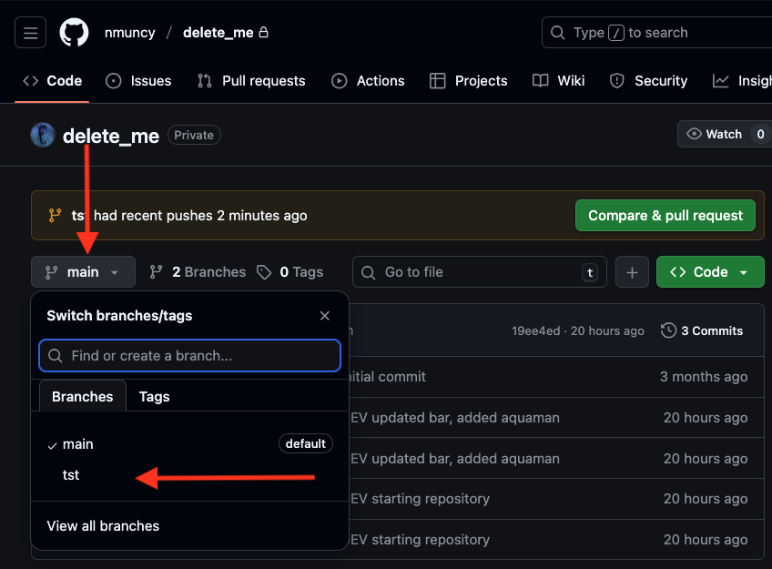{.fragment}

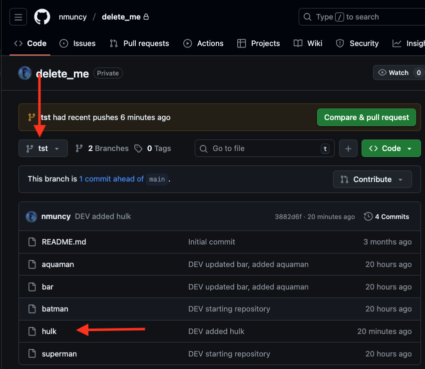{.fragment}
:::
::::
:::::

## Pull Requests: create

::::: columns
::: {.column width="50%" style="font-size: 65%;"}
- Desire to combine branch commit history with another (main)
- Send a request to pull the changes: "pull request"
  - Follow tab or green link
- Specify source and destination
- Add title, description of work
- Create or send pull request
:::

:::: {.column width="\"50%"}
::: {.r-stack}
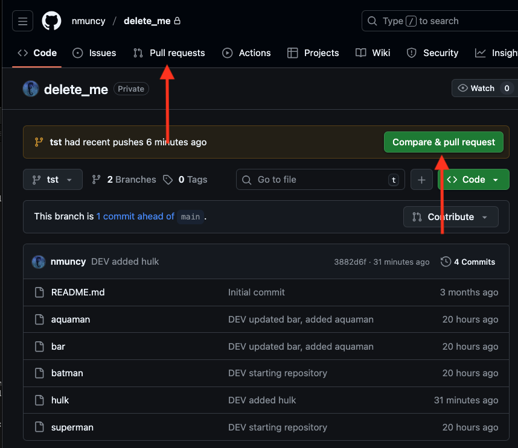

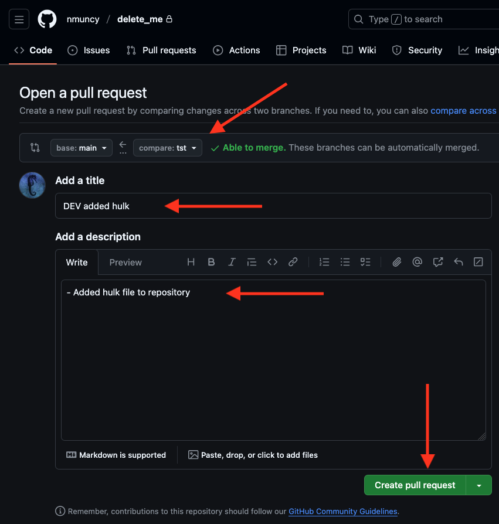{.fragment}
:::
::::
:::::

## Pull Requests: verify

::::: columns
::: {.column width="50%" style="font-size: 65%;"}
- Each pull request (and issue) is labeled
- Conflicts must be resolved before merging
- Review commit history
- Review files changed
:::

:::: {.column width="\"50%"}
::: {.r-stack}
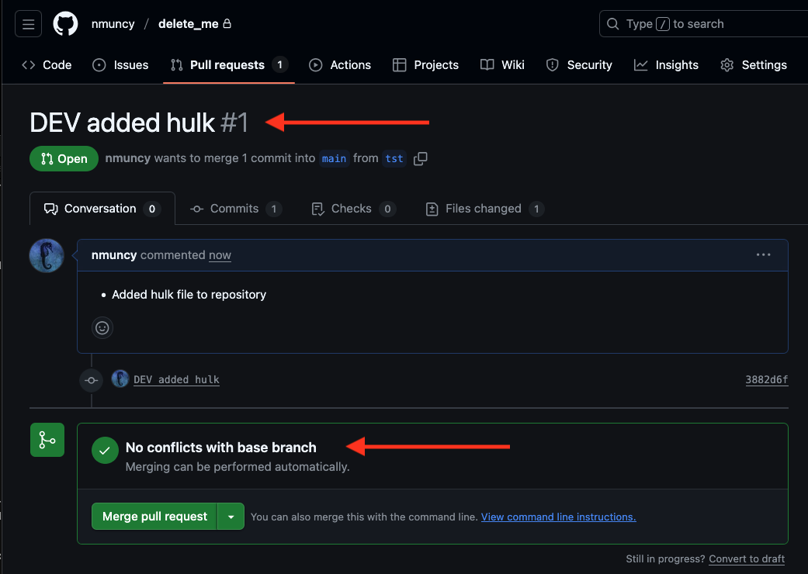

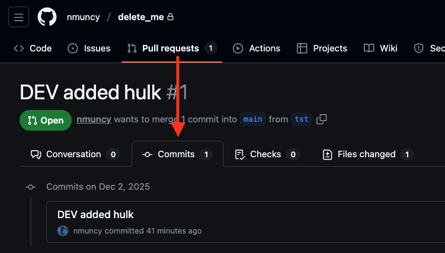{.fragment}

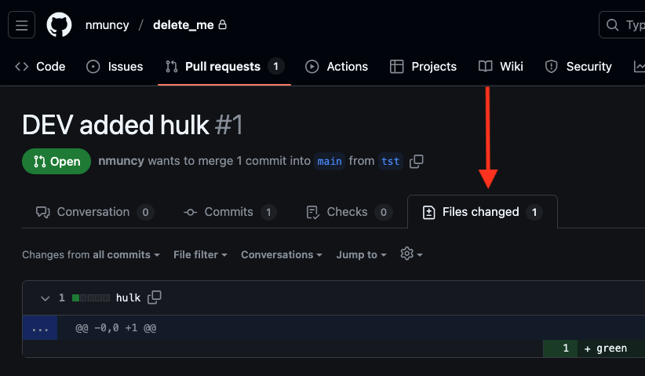{.fragment}
:::
::::
:::::

## Merging

::::: columns
::: {.column width="50%" style="font-size: 65%;"}
- Merge: add commit history of one branch to another
- Three methods to merge:
  - New commit
  - Squash
  - Rebase
- New commit and Squash are most common
- Rebase often used for trouble shooting
:::

:::: {.column width="\"50%"}

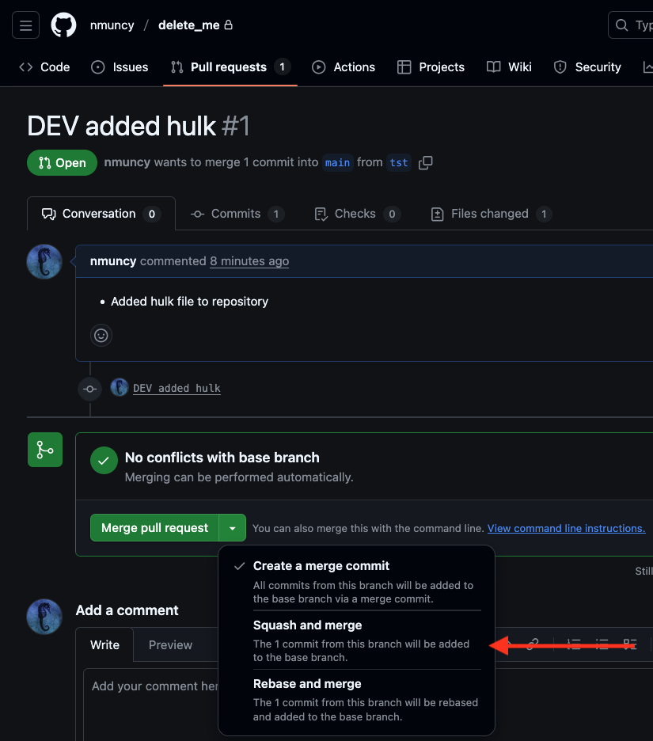

::::
:::::

## Merge: new commit

::::: columns
::: {.column width="50%" style="font-size: 65%;"}
- Create a new commit for merge
- Maintain branch history
- Add branch history, new commit to `main`
:::

:::: {.column width="\"50%"}

```{mermaid}
flowchart LR
  A(cmt1) --> B(cmt2) --> C(cmt3/HEAD)
  B --> D(cmt4) --> E(cmt5)
```

```{mermaid}
flowchart LR
  A(cmt1) --> B(cmt2) --> C(cmt3) --> D(cmt4)
  D --> E(cmt5) --> F(mrg1/HEAD)
```

::::
:::::

## Merge: squash

::::: columns
::: {.column width="50%" style="font-size: 65%;"}
- Create a new commit for merge
- Collapse branch history
- Only new commit sent to `main`
- Useful for keeping `main` clean
:::

:::: {.column width="\"50%"}

```{mermaid}
flowchart LR
  A(cmt1) --> B(cmt2) --> C(cmt3/HEAD)
  B --> D(cmt4) --> E(cmt5)
```

```{mermaid}
flowchart LR
  A(cmt1) --> B(cmt2) --> C(cmt3) --> D(mrg1/HEAD)
```

::::
:::::

## Merge: rebase

::::: columns
::: {.column width="50%" style="font-size: 65%;"}
- Create a new commit for merge
- Replace `main` HEAD with new commit
- Useful for fixing bad commit
:::

:::: {.column width="\"50%"}

```{mermaid}
flowchart LR
  A(cmt1) --> B(cmt2) --> C(cmt3/HEAD)
  B --> D(cmt4) --> E(cmt5)
```

```{mermaid}
flowchart LR
  A(cmt1) --> B(cmt2) --> D(mrg1/HEAD)
```

::::
:::::

## Merge: accept and prune

::::: columns
::: {.column width="50%" style="font-size: 65%;"}
- After deciding merge type, confirm
- Good practice: clean (prune) merged branches
:::

:::: {.column width="\"50%"}
::: {.r-stack}
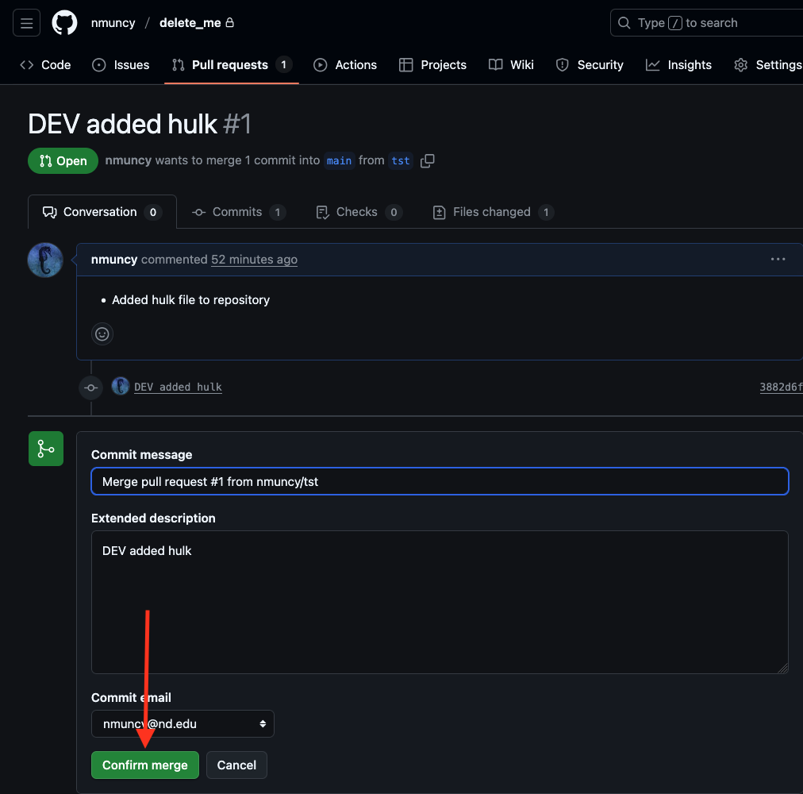

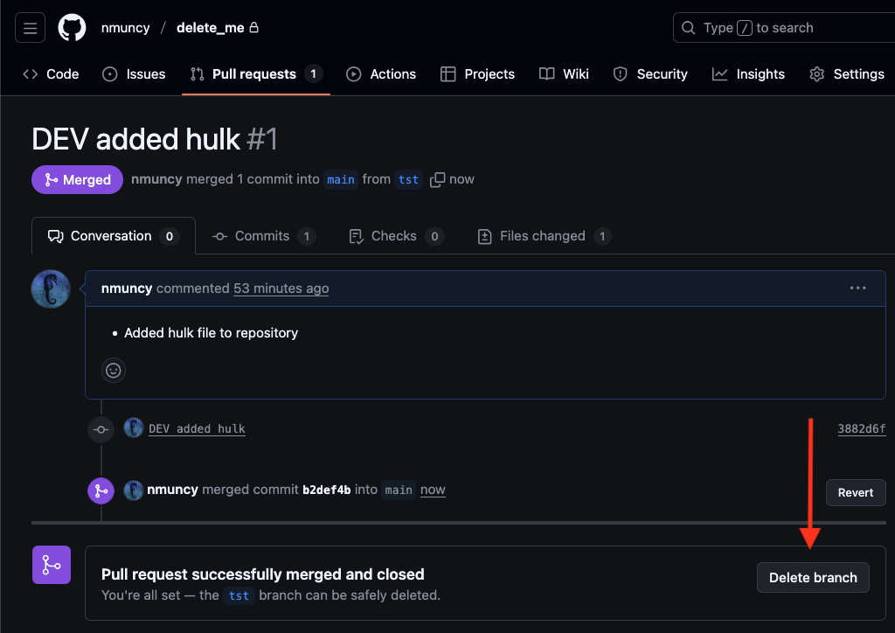{.fragment}

:::
::::
:::::


## Pull: bring updates locally

::::: columns
::: {.column width="50%" style="font-size: 65%;"}
- `git pull`: update current branch with origin
- `git branch -a`: see local and origin branches
- Note: outdated references
  - Local contains branch
  - Origin has branch (but we removed it)
:::

:::: {.column width="\"50%"}
::: {layout-nrow="2"}
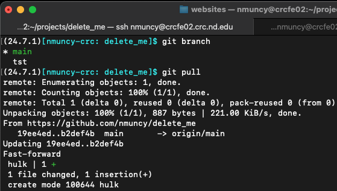

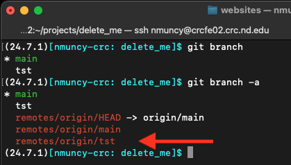
:::
::::
:::::

## Fetch and prune

::::: columns
::: {.column width="50%" style="font-size: 65%;"}
- `git fetch`: connect to origin, download changes
  - Does not update current branch
- `git fetch --prune`: remove connections to dead branches
- `git branch -d foo`: delete local branch "foo"
:::


:::: {.column width="\"50%"}
::: {layout-nrow="2"}
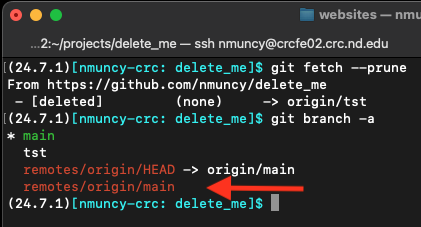

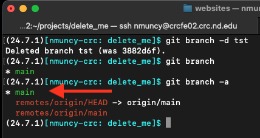
:::
::::
:::::

## Review commit history

::::: columns
::: {.column width="50%" style="font-size: 65%;"}
- History of `main` now reflects commit history from branch
:::

:::: {.column width="\"50%"}
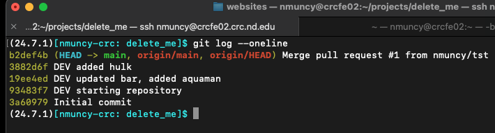
::::
:::::