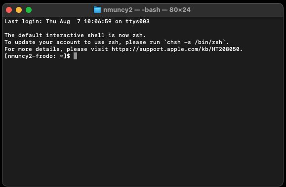
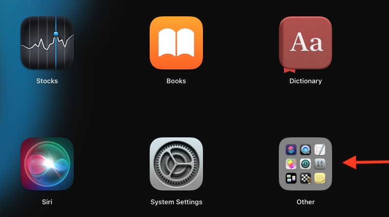
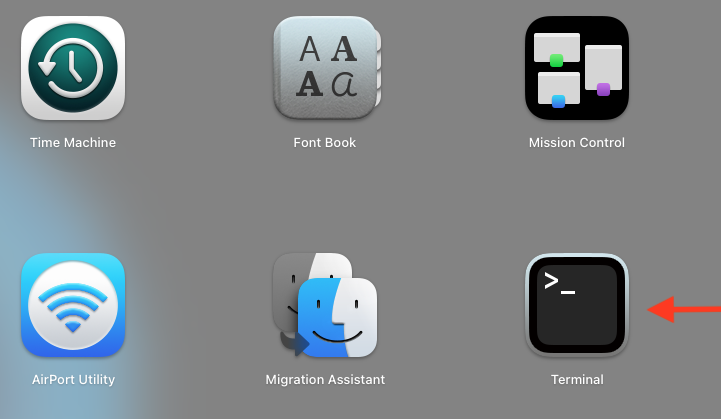
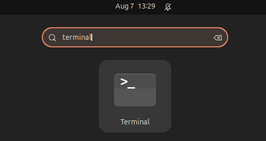
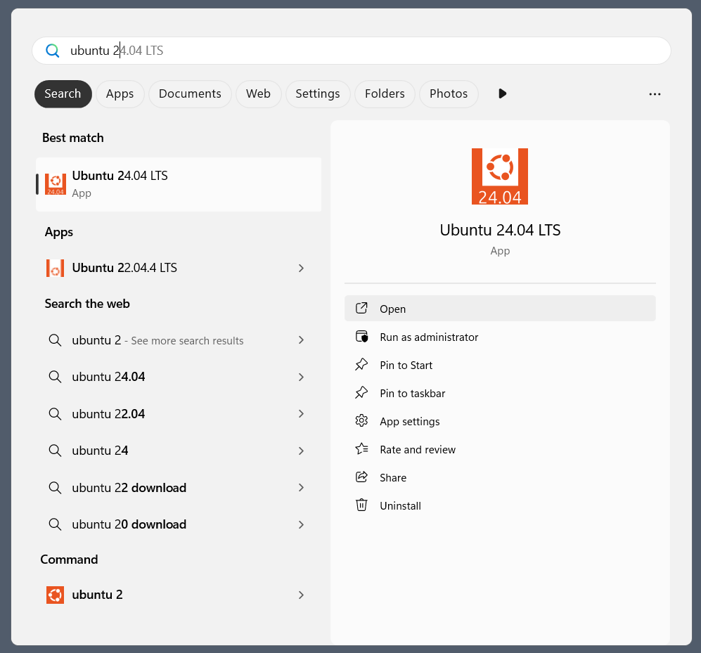
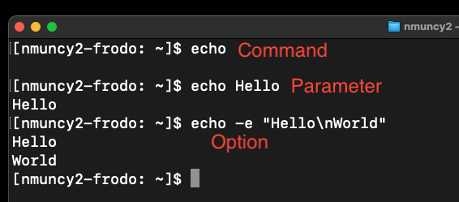
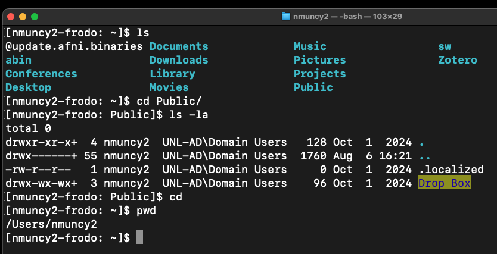
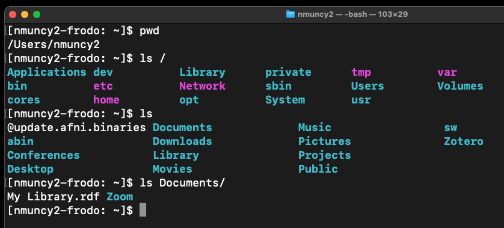
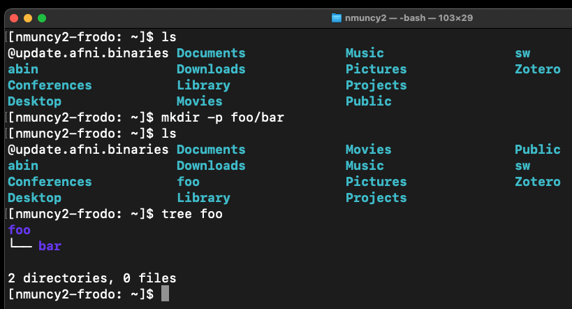

## What is a terminal

::::::: columns
::: {.column width="\"50%"}

:::

::::: {.column width="50%"}
:::: {style="font-size: 65%;"}
::: incremental
-   Application - provides access to the command shell
-   Default language - Bourne Again Shell (Bash)
-   Provide instruction to computer
-   Useful for:
    -   Automation
    -   Triggering software
:::
::::
:::::
:::::::

## Finding the terminal: Mac

:::::::: columns
::::: {.column width="50%"}
:::: {style="font-size: 65%;"}
::: incremental
-   Easy, built-in
-   Applications -\> Other -\> Terminal
-   Cmd + Space -\> Search "terminal"
:::
::::
:::::

:::: {.column width="\"50%"}
::: {layout-nrow="2"}
{.fragment} {.fragment}
:::
::::
::::::::

## Finding the terminal: Ubuntu

::::::: columns
::::: {.column width="50%"}
:::: {style="font-size: 65%;"}
-   Easy, built-in

::: incremental
-   Applications -\> Search "terminal"
:::
::::
:::::

::: {.column width="\"50%"}
{.fragment}
:::
:::::::

## Finding the terminal: Windows

::::::: columns
::::: {.column width="50%"}
:::: {style="font-size: 65%;"}
::: incremental
-   Semi-difficult
-   Activate Windows Subsytem Linux
    -   See [here](https://documentation.ubuntu.com/wsl/stable/howto/install-ubuntu-wsl2)
-   Install Ubuntu
-   Start -\> Search "Ubuntu"
:::
::::
:::::

::: {.column width="\"50%"}
{.fragment}
:::
:::::::

## Anatomy of commands

::::::: columns
::::: {.column width="50%"}
:::: {style="font-size: 65%;"}
::: incremental
-   Command: instruction to machine
    -   Matches executable in PATH
    -   Composed of arguments
    -   Separated by spaces
-   Types of Arguments:
    1.  Option: modify command, specified with flag "-"
    2.  Parameter: provides information to command or option
:::
::::
:::::

::: {.column width="\"50%"}
{.fragment}
:::
:::::::

## Foundational commands

::::::: columns
::::: {.column width="40%"}
:::: {style="font-size: 65%;"}
::: incremental
-   `pwd`: print working directory
-   `ls`: list directory contents
    -   `ls -l`: list with extra info
    -   `ls -a`: list all files
    -   `ls -la`: combine arguments
-   `cd`: change directories
    -   `cd foo`: go down into foo
    -   `cd ..`: go up one level
    -   `cd`: go HOME
:::
::::
:::::

::: {.column width="60%"}
{.fragment}
:::
:::::::

## Directory tree

::::::: columns
::::: {.column width="40%"}
:::: {style="font-size: 65%;"}
::: incremental
-   Every file has a path
-   Separate steps of path with "/"
-   Top of path: "root", OS essentials
-   Center: "\~", HOME, default
-   Below HOME: user files
:::
::::
:::::

::: {.column width="60%"}
{.fragment}
:::
:::::::

## Make directories

::::::: columns
::::: {.column width="40%"}
:::: {style="font-size: 65%;"}
::: incremental
-   `mkdir`: creates directory, requires parameter
    -   `mkdir foo`: create directory "foo"
-   Many available options:
    -   `mkdir -p foo/bar`: create directory "bar" within "foo" (and "foo" if it does not exist)
    -   See more options with `man mkdir`
        -   use down arrow to scroll
        -   use "q" to exit manual
-   `tree`: see directory tree structure
    -   Mac users: install with `brew install tree`
:::
::::
:::::

::: {.column width="60%"}
{.fragment}
:::
:::::::